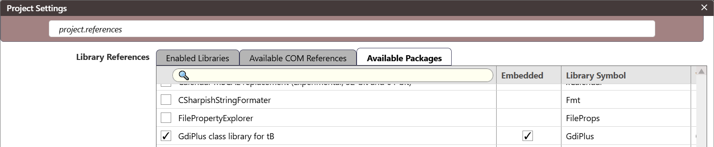

- [Introduction](#introduction)
- [Overview of Classes](#overview-of-classes)
  - [**GdiPlusBase**](#gdiplusbase)
  - [**GdiPlusUser**](#gdiplususer-2)
  - [**Graphics**](#graphics-2)
  - [**GraphicsPath**](#graphicspath), [**PathData**](#pathdata), [**PathIterator**](#pathiterator)
  - [**IDeviceContext**](#idevicecontext)
  - [**ITransformable**](#itransformable)
  - [**GpPointF**](#gppointf), [**GpPoint**](#gppoint), [**GpSizeF**](#gpsizef), [**GpSize**](#gpsize), [**GpRectF**](#gprectf), [**GpRect**](#gprect)
  - [**Pen**](#pen)
  - [*Brushes*](#brushes): [**IBrush**](#ibrush-brush), [**SolidBrush**](#SolidBrush), [**HatchBrush**](#hatchbrush), [**LinearGradientBrush**](#LinearGradientBrush), [**PathGradientBrush**](#PathGradientBrush), [**TextureBrush**](#texturebrush)
  - [**Color**](#color)
  - [**CColor** Constants](#ccolor-constants)
  - [**Font**](#font), [**FontFamily**](#fontfamily), [**FontCollection**](#fontcollection)
  - [**Matrix**](#matrix)
  - [**Image**](#image), [**Bitmap**](#bitmap), [**Metafile**](#metafile-2), [**CachedBitmap**](#cachedbitmap)
  - [**ImageAttributes**](#imageattributes)
  - [**ImageCodec**](#imagecodec): [**GpImageCodecInfo**](#gpimagecodecinfo)
  - [**ColorMatrix**](#colormatrix)
  - [**StringFormat**](#stringformat)
  - [**Region**](#region)
  - [**CustomLineCap**](#customlinecap), [**ArrowCap**](#arrowcap)
  - [*Effects*](#effects): [**Blur**](#blur), [**Sharpen**](#sharpen), [**BrightnessContrast**](#brightnesscontrast), [**HueSaturationLightness**](#huesaturationlightness), [**Levels**](#levels), [**Tint**](#tint), [**ColorBalance**](#colorbalance), [**ColorMatrixEffect**](#colormatrixeffect), [**ColorLUT**](#colorlut), [**ColorCurve**](#colorcurve), [**RedEyeCorrection**](#redeyecorrection)
  - [**VBGraphics**](#vbgraphics)
  - [**MetafileHeader**](#metafileheader)

---

# Introduction

This is a GDI+ (GdiPlus) package for twinBASIC. GdiPlus is a software graphics renderer that debuted in Windows XP. It is a successor to the integer-based GDI (graphics device interface) API.

The GdiPlus package is available from the TwinBasic Package Repository via the *Available Packages* panel in  Project Settings:



## GdiPlusUser

When using any of the classes, types or procedures in GDI+, there must exist an instance of `GdiPlusUser` class. An arbitrary number of instances can exist at one time. As long as *any* exist, the GDI+ library is kept active and usable. Since GDI+ is typically used to render forms, or is triggered by actions in the form-based UI, it is sufficient to add an instance of GdiPlusUser to any Form or other class whose code uses GDI+.

In a `Form`, the instance should be created in the `Load` event handler (named `Form_Load` by default):

```vb
Class Form1
    Dim mGdiPlus As GdiPlusUser
    
    Sub Form_Load()
        ScaleMode = vbPixels
        Set mGdiPlus = GdiPlusUser()
    End Sub
```

> [!WARNING]
> Do not use `Dim mGdiPlus As New GdiPlusUser`. This initializes the user object too late.

When directly handling window messages in low-level code or when subclassing forms, the instance should be created in response to `WM_CREATE` and destroyed in response to `WM_DESTROY`:

```vb
Dim user As GdiPlusUser
Static Function WndProc(ByVal hWnd&, ByVal message&, ByVal wParam As LongPtr, ByVal lParam As LongPtr) As LongPtr
    Select Case message
	    Case WM_CREATE
        	Set user = GdiPlusUser()
            '...
        Case WM_DESTROY
            Set user = Nothing
            '...
        '...
```

The instances created as above don't need non-default arguments.

To initialize GdiPlus with custom arguments, create an instance in `Sub Main`, in the main application `Form`, or in the main application window's `WM_CREATE` message handler.

> [!NOTE]
> The custom arguments should only be provided once, when the first instance of **GdiPlusUser** is created. Any arguments provided in subsequent invocations are ignored.

## Graphics

`Graphics` is the principal class used to render in GDI+. It is created using free-standing constructor functions (i.e. without the `New` keyword).
`Graphics` can be created from:

- A device context, and optionally a device (usually in case of printing):
  `GraphicsFromHDC(ByVal hdc As LongPtr, ByVal hdevice As LongPtr = 0) As Graphics`
- A window handle, optionally using color management (ICM):
  `GraphicsFromHWND(ByVal hwnd As LongPtr) As Graphics`
  `GraphicsFromHWNDICM(ByVal hwnd As LongPtr) As Graphics`
- An `Image`:
  `CreateFromImage(image As Image) As GpStatus`

To maintain flicker-free drawing on visible surfaces such as windows, forms and controls, the buffered constructors are available to create a double-buffered `Graphics` object from:

* A device context:
  `BufferedGraphicsFromHDC(ByVal hdc As LongPtr, drawArea As GpRect) As Graphics`
* A window handle (no ICM is available):
  `BufferedGraphicsFromHWND(ByVal hwnd As LongPtr) As Graphics`

The buffered graphics objects are recommended for use when painting on device contexts and windows.

The rendering period starts when a `Graphics` object is created, and ends when it is destroyed (terminated).  The object should have a **transient** character, and should exist only during the rendering operations.

### Using Graphics within the `WM_PAINT` message

```vb
Function WndProc(ByVal hWnd&, ByVal message&, ByVal wParam As LongPtr, ByVal lParam As LongPtr) As LongPtr
    Dim rect As GDIP_RECT
    Dim gr as Graphics

    Select Case message
    	Case WM_PAINT
        	GetClientRect(hWnd, rect)
        	Set gr = BufferedGraphicsFromHWND(hWnd)
            ' perform painting
            Set gr = Nothing	' optionally explicitly destroy the Graphics object
        Case WM_SIZE
            GetClientRect(hWnd, rect)
            InvalidateRect(hWnd, rect, False)
        '...
```

### Using Graphics in a Form.Paint handler

```vb
Class Form1
    Sub Paint() Handles Form.Paint
        Dim rect As Any = GpRect(0, 0, ScaleWidth, ScaleHeight)
        Dim gr As Any = BufferedGraphicsFromHDC(hDC, rect)
        ' perform painting
        Set gr = Nothing    ' optionally explicitly destroy the Graphics object
   	End Sub
	Sub Resize() Handles Form.Resize
   		Refresh
    End Sub
    ' ...
```

---

# Overview of Classes

The GDI+ methods that take *cartesian* coordinates exist in both floating point and integer overloads.

- Floating-point overloads take **Single**, **GpPointF**, **GpSizeF**,  and **GpRectF** arguments, as well as arrays of them.
- Long (integer) overloads take **Long**, **GpPoint**, **GpSize**,  and **GpRect** arguments, as well as arrays of them.

If there are overloads that take scalar **Single** coordinates, the corresponding integer (**Long**) overloads have the `I` suffix. This is required due to how overload resolution works in twinBASIC.

There are no mixed overloads, an overload either takes all floating point cartesian coordinates, or all integer (Long) coordinates.

There are no integer overloads for non-cartesian coordinates such as angles, nor for scale factors.

---

## GdiPlusBase

This is the base class of the GdiPlus classes. It retains the result of the last operation performed on the derived class, and enables error handling.

* <sup>get</sup> **LastResult** As **GpStatus** - the result of the last operation performed on the derived class.

> [!TIP]
> This property records the most recent *error* that occurred. Is does *not* automatically reset to Ok. To reset, use **ClearResult** or **GetLastResult**

* <sup>get</sup> **Status** As **String** - a textual description of **LastResult**

* <sup>get</sup> **StatusNL** As **String** - a textual description of **LastResult** with **vbCrLf** appended

* **ClearResult** (), **GetLastResult** () As **GpStatus** - clears the status to Ok, and returns the previous status

* *Static* **Alloc** (size As **LongPtr**) As **LongPtr** - allocates a memory block using the GdiPlus allocator

* *Static* **Free** (ptr As **LongPtr**) - frees a memory block that was previously allocated using **Alloc**

* *Protected* **SetStatus** (status As **GpStatus**) As **GpStatus**
  This method is invoked by essentially every method in the derived GDI+ classes, except for the few methods and functions that can't fail.
  If the provided status is *not* **Ok**, it is first recorded in **LastResult**, and then the error handling strategy is executed.

### Error Handling

All constructors and most methods of GdiPlus classes may fail. All the methods that don't return a specific result, return **GpStatus** indicating either success or failure. Before being returned, this status is first passed to the **GdiPlusBase.SetStatus** method.

> [!NOTE]
> For conciseness, if a method is documented as returning no result, it will return **GpStatus**. The exceptions are *Sub* methods specifically documented as such.

When a constructor fails, it creates an unusable object whose **LastResult** indicates the reason for the failure.

The following global variables configure the error handling behavior of **GdiPlusBase.SetStatus**:

- **GdipErrorCodeBase**& = 3300
  The base error code for the RaiseErrors strategy. The status is added to this base code.
- **GdipErrorHandlingStrategy** As **GpErrorHandlingStrategy**
  Whether the errors from GdiPlus objects are ignored, `Err.Raise`-d, or processed by a handler. The available error handling strategies are:
  - **IgnoreErrors** - the error is recorded in **LastResult** but otherwise ignored. *This is the default strategy*.
  - **RaiseErrors** - the error is recorded in **LastResult**, then a BASIC error is raised by `Err.Raise GdipErrorCodeBase + LastResult`.
  - **HandleErrors** - the error is recorded in **LastResult**. Then, if the **GdipErrorHandler** delegate is set to the address of a handler function, said handler function is invoked.
  - **StopOnErrors** - the error is recorded in **LastResult**. The `Stop` statement is subsequently executed. This acts as a debugger breakpoint.
- **GdipErrorHandler** As **GdipErrorHandler** = 0
  The error handler to be invoked upon errors when the strategy is HandleErrors.

### Delegate Types

* *Function* **GdipErrorHandler** (*ByVal* obj As **GdiPlusBase**)
  This function is passed the object whose method failed. That object's **LastResult** has been preset to the **GpStatus** of the failing method.

---

## GdiPlusUser

At least one instance of this class must exist to use the GdiPlus package.

The first instance will initialize the GdiPlus library with given startup parameters/input.

### Constructors

By default, GdiPlus version 2 will be initialized. If this fails, version 1 will be initialized. If that fails as well, the **LastResult** of the newly created **GdiPlusUser** object will indicate a failure.

* **GdiPlusUser** (startupParams As **GdiplusStartupParams** = GdiplusStartupDefault)
* **GdiPlusUser** (input As **GdiPlusStartupInput**)
* **GdiPlusUser** (input As **GdiPlusStartupInput**, <sup>out</sup> output As **GdiPlusStartupOutput**)

> [!NOTE]
> The arguments are only used when the first instance of **GdiPlusUser** is created. Subsequent invocations of the constructors discard the arguments!

The default arguments are suitable for most use cases. If special arguments are needed, they should be provided in a single location where the first instance of **GdiPlusUser** is created. Typically that would be `Sub Main`, or in the `WM_CREATE` message handler of the main application window.

### Methods

* **GetBuildNumber** () As **Long** - returns the GDI+ build number
* **TestControlForceBilinear** (force As **Boolean**) - forces bilinear scaling (for testing/debugging)
* **TestControlNoICM** (noICM As **Boolean**) - disables ICM (for testing/debugging)

### GdiplusStartupInput Type

* **GdiplusVersion**&

  1. available starting with Windows XP

  2. available starting with Windows 10

  3. same as 2, but enables the HEIF and AVIF image codes. These codecs require COM to be initialized.

> [!IMPORTANT]
> The GdiPlus package does not initialize COM. The user is expected to do it when using version 3 of GdiPlus.

* **SuppressExternalCodecs** As **BOOL**

* **StartupParameters** As **GdiPlusStartupParams**

### GdiPlusStartupParams Flags

These flags are ignored by GdiPlus version 1.

* **GdiplusStartupDefault** = 0
* **GdiplusStartupNoSetRound** = 1
* **GdiplusStartupSetPSValue** = 2
* **GdiplusStartupTransparencyMask** = `&hFF00_0000`

### GdiplusStartupOutput Type

Returned by the constructor overload that takes an *output* parameter. Contains notification callbacks that the user must call appropriately if **SuppressBackgroundThread** is set.

* **NotificationHook** As **NotificationHookProc**
* **NotificationUnhook** As **NotificationUnhookProc**

### Notification Functions

These are used when **SuppressBackgroundThread** is set in the startup input.

* *Delegate* **NotificationHookProc** (<sup>out</sup> token As **ULONG**) As **GpStatus**
* *Delegate* **NotificationUnhookProc** (token As **ULONG**)
* **NotificationHook** (token As **LongPtr**) As **GpStatus** - calls `GdiplusNotificationHook`
* **NotificationUnhook** (token As **LongPtr**) - calls `GdiplusNotificationUnhook`

---

## Graphics

**Graphics** implements [**ITransformable**](#itransformable) and [**IDeviceContext**](#idevicecontext).

- [Constructors](#constructors-2)
- [Outline Drawing](#outline-drawing)
- [Filled Drawing](#filled-drawing)
- [Image Drawing](#image-drawing)
- [Text Measurement](#text-measurement)
- [Metafile Playback and Recording](#metafile)
- [Clipping](#clipping)
- [Clipping Visibility Checks](#clipping-visibility-checks)
- [State and Container Stack](#state-and-container-stack)
- [Rendering State](#rendering-state)
- [World Transform](#world-transform)
- [Color Approximation](#color-approximation)
- [GDI Interoperability](#gdi-interoperability)

### Constructors

* **BufferedGraphicsFromHWND** (hwnd As **LongPtr**) - creates a buffered graphics object. All drawing is done on a cached bitmap, which is subsequently blitted into window at the destruction of the Graphics object.
  This is the preferred way of painting on a window when handling a paint event.
* **BufferedGraphicsFromHDC** (hdc As **LongPtr**, area As **GpRect**) - creates a buffered graphics object. All drawing is done on a cached bitmap, which is subsequently blitted into *hdc* at the destruction of the Graphics object.
* **GraphicsFromHDC** (hdc As **LongPtr**, hdevice As **LongPtr** = 0)
* **GraphicsFromHWND** (hwnd As **LongPtr**)
* **GraphicsFromHWNDWithICM** (hwnd As **LongPtr**)
* **GraphicsFromImage** (image As **Image**) - creates a graphics object that draws on the image. The image may be a **Bitmap** or a **Metafile**. In the latter case, the metafile records all the graphics operations for subsequent playback (drawing).

### Flush

* **Flush** (intention As **GpFlushIntention**) - flushes all pending graphics operations. The intention parameter controls whether the method returns immediately (FlushIntentionFlush) or waits for completion (FlushIntentionSync).

### Bulk Clearing

* **Clear** (rgb&)
* **Clear** (color As **Color**)

### Outline Drawing

- Line Drawing

  - **DrawLine** (pen As **Pen**, ...
    - ... x1!, y1!, x2!, y2!)
    - ... pt1 As **GpPoint[F]**, pt2 As **GpPoint[F]**)
    - ... rect As **GpRect[F]**) - draws a diagonal line
  - **DrawLineI** (pen As **Pen**, x1&, y1&, x2&, y2&)
  - **DrawLines** (pen As **Pen**, points() As **GpPoint[F]**)

- Arc Drawing

  - **DrawArc** (pen As **Pen**, ..., startAngle!, endAngle!)
    - ... x!, y!, width!, height!, ...
    - ... pt As **GpPoint[F]**, size As **GpSize[F]**, ...
    - ... rect As **GpRect[F]**, ...
  - **DrawArcI (pen As **Pen**, x&, y&, width&, height&, startAngle!, endAngle!)

- Bezier Curve Drawing

  - **DrawBezier** (pen As **Pen**, ...
    - ... x1!, y1!, x2!, y2!, x3!, y3!, x4!, y4!)
    - ... pt1 As **GpPoint[F]**, pt2 As **GpPoint[F]**, pt3 As **GpPoint[F]**, pt4 As **GpPoint[F]**)
    - ... points() As **GpPoint[F]**)
  - **DrawBezierI** (pen As **Pen**, x1&, y1&, x2&, y2&, x3&, y3&, x4&, y4&)
  - **DrawBeziers** (pen As **Pen**, points() As **GpPoint[F]**)

- Rectangle Drawing

  - **DrawRectangle** (pen As **Pen**, ...
    - ... x!, y!, width!, height!)
    - ... pt As **GpPoint[F]**, size As **GpSize[F]**)
    - ... rect As **GpRect[F]**)
  - **DrawRectangleI** (pen As **Pen**, x&, y&, width&, height&)
  - **DrawRectangles** (pen As **Pen**, rects() As **GpRect[F]**)

- Ellipse Drawing

  - **DrawEllipse** (pen As **Pen**, ...
    - ... x!, y!, width!, height!)
    - ... pt As **GpPoint[F]**, size As **GpSize[F]**)
    - ... rect As **GpRect[F]**)
  - **DrawEllipseI** (pen As **Pen**, x&, y&, width&, height&)

- Pie Drawing

  - **DrawPie** (pen As **Pen**, ..., startAngle!, endAngle!)
    - ... x!, y!, width!, height!, ...
    - ... pt As **GpPoint[F]**, size As **GpSize[F]**, ...
    - ... rect As **GpRect[F]**, ...
  - **DrawPieI** (pen As **Pen**, x&, y&, width&, height&, startAngle!, endAngle!)

- Polygon Drawing

  - **DrawPolygon** (pen As **Pen**, points() As **GpPoint[F]**)

- Path Drawing

  - **DrawPath** (pen As **Pen**, path As **GraphicsPath**)

- Curve Drawing

  - **DrawCurve** (pen As **Pen**, ...)
    **DrawCurve** (pen As **Pen**, ..., tension!)
    **DrawCurve** (pen As **Pen**, ..., offset&, numberOfSegments&, tension! = 0.5)
    - ... points() As **GpPoint[F]**, ...

- Closed Curve Drawing

  - **DrawClosedCurve** (pen As **Pen**, ...)
    **DrawClosedCurve** (pen As **Pen**, ..., tension!)
    - ... points() As **GpPoint[F]**, ...

- Text Drawing

  > [!NOTE]
  > These methods don't have integer overloads

  - **DrawString** (str$, font As **Font**, ..., brush As **Brush**)
    - ... layoutRect As **GpRectF**, format As **StringFormat**, ...
    - ... origin As **GpPointF**, ...
    - ... origin As **GpPointF**, format As **StringFormat**, ...
    - ... x!, y!, ...
    - ... x!, y!, format As **StringFormat**, ...
  - **DrawDriverString** (str$, font As **Font**, brush As **Brush**, ..., flags As **GpDriverStringOptions**, matrix As **Matrix**)
    - ... position As **GpPointF**, ...
    - ... positions() As **GpPointF**, ...
  - **DrawDriverString** (glyphs() As **Integer**, font As **Font**, brush As **Brush**, ..., flags As **GpDriverStringOptions**, matrix As **Matrix**)
    - ... position As **GpPointF**, ...
    - ... positions() As **GpPointF**, ...

### Filled Drawing

* Filled Rectangle
  - **FillRectangle** (brush As **Brush**, ...
    - ... x!, y!, width!, height!)
    - ... pt As **GpPoint[F]**, size As **GpSize[F]**)
    - ... rect As **GpRect[F]**)
  - **FillRectangleI** (brush As **Brush**, x&, y&, width&, height&)
  - **FillRectangles** (brush As **Brush**, rects() As **GpRect[F]**)
* Filled Polygon
  - **FillPolygon** (brush  As **Brush**, points() As **GpPoint[F]**)
* Filled Ellipse
  - **FillEllipse** (brush  As **Brush**, ...
    - ... x!, y!, width!, height!)
    - ... pt As **GpPoint[F]**, size As **GpSize[F]**)
    - ... rect As **GpRect[F]**)
  - **FillEllipseI** (brush  As **Brush**, x&, y&, width&, height&)
* Filled Pie
  - **FillPie** (brush  As **Brush**, ..., startAngle!, endAngle!)
    - ... x!, y!, width!, height!, ...
    - ... pt As **GpPoint[F]**, size As **GpSize[F]**, ...
    - ... rect As **GpRect[F]**, ...
  - **FillPieI** (brush As **Brush**, x&, y&, width&, height&, startAngle!, endAngle!)
* Filled Path
  - **FillPath** (brush As **Brush**, path As **GraphicsPath**)
* Filled Closed Curve
  - **FillClosedCurve** (brush  As **Brush**, ...)
    **FillClosedCurve** (brush  As **Brush**, ..., fillMode As **GpFillMode**, tension!)
    - ... points() As **GpPoint[F]**, ...
* Filled Region
  * **FillRegion** (brush As **Brush**, region As **Region**)

### Image Drawing

* **DrawImage** (image As **Image**, ...
  * ... rect As **GpRect[F]**)
  * ... point As **GpPoint[F]**)
  * ... x!, y!)
  * ... x!, y!, width!, height!)
  * ... destPoints() As **GpPoint[F]**)
  * ... x!, y!, srcX!, srcY!, srcWith!, srcHeight!, srcUnit As **GpUnit**)
  * ... dest As **GpRect[F]**, src As **GpRect[F]**, srcUnit As **GpUnit**, <sup>optional</sup> attributes As **ImageAttributes**, <sup>optional</sup> callback As **LongPtr**, <sup>optional</sup> callbackData As **LongPtr**)
  * ... destPoints() As **GpPointF**, srcX!, srcY!, srcWidth!, srcHeight!, srcUnit As **GpUnit**, <sup>optional</sup> attributes As **ImageAttributes**, <sup>optional</sup> callback As **LongPtr**, <sup>optional</sup> callbackData As **LongPtr**)
  * ... destPoints() As **GpPoint**, srcX&, srcY&, srcWidth&, srcHeight&, srcUnit As **GpUnit**, <sup>optional</sup> attributes As **ImageAttributes**, <sup>optional</sup> callback As **LongPtr**, <sup>optional</sup> callbackData As **LongPtr**)
  * ... src As **GpRectF**, xform As **GpMatrix**, effect As **Effect**, attributes As **ImageAttributes**, srcUnit As **GpUnit**)
* **DrawImageI** (image As **Image**, ...
  * ... x&, y&)
  * ... x&, y&, width&, height&)
  * ... x&, y&, srcX&, srcY&, srcWith&, srcHeight&, srcUnit As **GpUnit**)
* **DrawImageRECT** (image As **Image**, sourceRect As **GDIP_RECTF**, xForm As **Matrix**, effect As **Effect**, imageAttributes As **ImageAttributes**, srcUnit As **GpUnit**) - low-level variant of DrawImage that takes a native **GDIP_RECTF** source rectangle

#### Cached Bitmap Drawing

* **DrawCachedBitmap** (cb As **CachedBitmap**, offset As **GpPoint**)
* **DrawCachedBitmapI** (cb As **CachedBitmap**, x&, y&)

> [!NOTE]
> Drawing a **CachedBitmap** will fail with **WrongState** if the cached bitmap's native format differs from this **Graphics** context (e.g. if the display resolution or color depth changed since the **CachedBitmap** was created).

### Text Measurement

> [!NOTE]
> These methods don't have integer overloads

* **MeasureString** (str$, font As **Font**, ...
  * ... layoutRect As **GpRectF**, format As **StringFormat**, <sup>out</sup> bBox As **GpRectF**, <sup>optional out</sup> codePointsFitted&, <sup>optional out</sup> linesFilled&)
  * ... layoutSize As **GpSizeF**, format As **StringFormat**, <sup>out</sup> size As **GpSizeF**, <sup>optional out</sup> codePointsFitted&, <sup>optional out</sup> linesFilled&)
  * ... origin As **GpPointF**, format As **StringFormat**, <sup>out</sup> bBox As **GpRectF**)
  * ... layoutRect As **GpRectF**, <sup>out</sup> bBox As **GpRectF**)
  * ... origin As **GpPointF**, <sup>out</sup> bBox As **GpRectF**)
* **MeasureCharacterRanges** (str$, font As **Font**, layoutRect As **GpRectF**, format As **StringFormat**) As **Region()**
* **MeasureCharacterRanges** (str$, font As **Font**, layoutRect As **GpRectF**, format As **StringFormat**, <sup>out</sup> regions() As **Region**)
  The *regions* array is resized to contain the measurement results. For performance's sake, any existing **Region** instances in the array provided are reused. However, at input, *regions* can be an array of any size, including an empty array.
* **MeasureDriverString** (str$, font As **Font**, brush As **Brush**, ..., flags As **GpDriverStringOptions**, matrix As **Matrix**, <sup>out</sup> bbox As **GpRectF**)
  * ... position As **GpPointF**, ...
  * ... positions() As **GpPointF**, ...

* **MeasureDriverString** (glyphs() As **Integer**, font As **Font**, brush As **Brush**, ..., flags As **GpDriverStringOptions**, matrix As **Matrix**, <sup>out</sup> bbox As **GpRectF**)
  * ... position As **GpPointF**, ...
  * ... positions() As **GpPointF**, ...

### Metafile

* Playback:
  **EnumerateMetaFile** (metafile As **Metafile**, ..., callback As **EnumerateMetafileProc**, <sup>optional</sup> callbackData As **LongPtr**, <sup>optional</sup> attributes As **ImageAttributes**)
  * ... dst As **GpPoint[F]**, ...
  * ... dst As **GpRect[F]**, ...
  * ... dstPoints() As **GpPoint[F]**, ...
  * ... dstPoint As **GpPoint[F]**, srcRect As **GpRect[F]**, srcUnit As **GpUnit**, ...
  * ... dstRect As **GpRect[F]**, srcRect As **GpRect[F]**, srcUnit As **GpUnit**, ...
  * ... dstPoints() As **GpPoint[F]**, srcRect As **GpRect[F]**, srcUnit As **GpUnit**, ...

* While recording:
  **AddMetafileComment** (<sup>ByRef</sup> data As **Byte**, sizeData&)

### Clipping

* <sup>get</sup> **Clip** As **Region**
* <sup>get</sup> **[Visible]ClipBounds** As **GpRectF**
* <sup>get</sup> **[Visible]ClipBoundsI** As **GpRect**
* <sup>get</sup> **Is[Visible]ClipEmpty** As **Boolean**
* **SetClip** (..., combineMode As **GpCombineMode** = CombineModeReplace)

* * ... g As **Graphics**, ...
  * ... rect As **GpRect[F]**, ...
  * ... path As **GraphicsPath**, ...
  * ... region As **Region**, ...
  * ... hRgn As **LongPtr**, ...
* **IntersectClip** (...)
  * ... rect As **GpRect[F]**, ...
  * ... region As **Region**, ...
* **ExcludeClip** (...)
  * ... rect As **GpRect[F]**, ...
  * ... region As **Region**, ...
* **ResetClip**
* **TranslateClip** (...)
  * ... delta As **GpPoint[F]**, ...
  * ... dx!, dy!, ...
* **TranslateClipI** (dx&, dy&)

### Clipping Visibility Checks

* **IsVisible** (...)
  * ... x!, y!, ...
  * ... x!, y! width!, height!, ...
  * ... point As **GpPoint[F]**, ...
  * ... rect As **GpRect[F]**, ...
* **IsVisibleI** (x&, y&, width&, height&)

### State and Container Stack

* **Save** () As **GraphicsState**
* **Restore** (state As **GraphicsState**)
* **BeginContainer** (dst As **GpRect[F]**, src As **GpRect[F]**, srcUnit As **GpUnit**) As **GraphicsContainer**
* **BeginContainer** () As **GraphicsContainer**
* **EndContainer** (state As **GraphicsContainer**)

### Rendering State

* **RenderingOrigin** As **GpPoint**
  **SetRenderingOrigin** (x&, y&)
  **GetRenderingOrigin** (<sup>out</sup> x&, <sup>out</sup> y&)
* **CompositingMode** As **GpCompositingMode**
* **CompositingQuality** As **GpCompositingQuality**
* **TextRenderingHint** As **GpTextRenderingHint**
* **TextContrast** As **UINT**
* **InterpolationMode** As **GpInterpolationMode**
* **SmoothingMode** As **GpSmoothingMode**
* **PixelOffsetMode** As **GpPixelOffstMode**

### World Transform

**Graphics** implements [**ITransformable**](#itransformable). In addition, it has the following properties/methods:

* **PageUnit** As **GpUnit**
* **PageScale** As **Single**
* **DpiX** As **Single**, **DpiY** As **Single**
* **TransformPoints** (dst As **GpCoordinateSpace**, src As **GpCoordinateSpace**, <sup>in/out</sup> pts() As **GpPoint[F]**)

### Color Approximation

* **GetHalftonePalette** () As **HPALETTE**

The two functions below apply only when **Graphics** is backed by an image/bitmap with a palette, i.e. 8bits/pixel or less.

* **GetNearestColorTo** (color As **Color**) As **Color** - returns a palette color closest to *color*
* **GetNearestColor** (<sup>in/out</sup> color As **Color**) - replaces *color* with the nearest palette color

### GDI Interoperability

* **GetHDC** () As **LongPtr**
* **ReleaseHDC** ()
* **ReleaseHDC** (hdc As **LongPtr**)

---

## GraphicsPath

### Constructors

* **GraphicsPath**(..., fillMode As **GpFillMode** = FillModeAlternate)
  * ...  -- creates an empty path
  * ... pathData As **PathData**, ...
  * ... typedPoints() As **TypedPoint**, ...
  * ... points() As **GpPoint[F]**, types() As **PathPointType**, ...
* **Clone** ()

### Related Types

#### TypedPoint

This UDT stores the position and type of a path point. It provides an alternative to providing point positions and point types separately.

* **pos** As **GpPointF**
* **type** As **PathPointType**

#### PathPointType

* <sup>get</sup> **PointType** As **GpPathPointType**
  - **PathPointTypeStart** = 0
  - **PathPointTypeLine** = 1
  - **PathPointTypeBezier** = 3
* <sup>get</sup> **DashMode** As **Boolean**
* <sup>get</sup> **PathMarker** As **Boolean**
* <sup>get</sup> **CloseSubpath** As **Boolean**

#### PathData

* Constructors
  * **PathData** (count&)
  * **PathData** (points() As **TypedPoint**)
  * **PathData** (pd As **GpPathData**)
* Properties
  * **Point** (index&) As **GpPointF**
  * **Type** (index&) As **PathPointType**
  * **TypedPoint** (index&) As **TypedPoint**
* Methods
  * **Allocate** (count&) - allocates memory for a certain number of points and types
  * **Points** () As **GpPointF()** - returns a static view of the points. This view is only valid as long as this instance of **PathData** exists and has not been reallocated
  * **Types** () As **PathPointType()** - returns a static view of the point types. This view is only valid as long as this instance of **PathData** exists and has not been reallocated
  * **TypedPoints** () As **TypedPoint** () - copies the point and type data to an array of **TypedPoint** and returns it

### Properties

* **FillMode** As **GpFillMode**
* <sup>get</sup> **PathData** As **PathData**
* <sup>get</sup> **LastPoint** As **GpPointF**
* <sup>get</sup> **PointCount** As **Long**

### Methods

* **Reset** () - empties the path and sets fill mode to *FillModeAlternate*
* **StartFigure** (), **CloseFigure** (), **CloseAllFigures** ()
* **SetMarker** (), **ClearMarkers** ()
* **Reverse** ()
* **Transform** (matrix As **Matrix**)
* **GetWorldBounds** (<sup>out</sup> bounds As **GpRect[F]**, matrix As **Matrix**, pen As **Pen**)
* **Flatten** (<sup>opt</sup> matrix As **Matrix**, flatness! = FlatnessDefault)
* **Widen** (pen As **Pen**, <sup>opt</sup> matrix As **Matrix**, flatness! = FlatnessDefault)
* **Outline** (<sup>opt</sup> matrix As **Matrix**, flatness! = FlatnessDefault)
* **Warp** (destPoints() As **GpPointF**, ..., <sup>opt</sup> matrix As **Matrix**, warpMode As **GpWarpMode** = WarpModePerspective, flatness! = FlatnessDefault)
  There is no integer overload of this method.
  * ... srcRect As **GpRectF**, ...
  * ... srcX!, srcY!, srcWidth!, srcHeight!, ...
* **GetTypes** (types() As **Byte**)
* **GetPoints** (points() As **GpPoint[F]**)
* **IsVisible** (..., <sup>opt</sup> g As **Graphics**)
  * (point As **GpPointF**, ...
  * (x!, y!, ...
* **IsVisibleI** (x&, y&, <sup>opt</sup> g As **Graphics**)
* **IsOutlineVisible** (..., pen As **Pen**, <sup>opt</sup> g As **Graphics**)
  * (point As **GpPointF**, ...
  * (x!, y!, ...
* **IsOutlineVisibleI** (x&, y&, pen As **Pen**, <sup>opt</sup> g As **Graphics**)

#### Drawing

* Line Drawing
  * **AddLine** (...)
    * (pt1 As **GpPoint[F]**, pt2 As **GpPoint[F]**)
    * (x1!, y1!, x2!, y2!)
  * **AddLineI** (x1&, y1&, x2&, y2&)
  * **AddLines** (points() As **GpPoint[F]**)
* Arc Drawing
  * **AddArc** (..., startAngle!, endAngle!)
    * (rect As **GpRect[F]**, ...
    * (x!, y!, width!, height!, ...
  * **AddArcI** (x&, y&, width&, height&, startAngle!, endAngle!)
* Bezier Curve Drawing
  * **AddBezier** (...)
    * (pt1 As **GpPoint[F]**, pt2 As **GpPoint[F]**, pt3 As **GpPoint[F]**, pt4 As **GpPoint[F]**)
    * (x1!, y1!, x2!, y2!, x3!, y3!, x4!, y4!)
  * **AddBezierI** (x1&, y1&, x2&, y2&, x3&, y3&, x4&, y4&)
  * **AddBeziers** (points() As **GpPoint[F]**)
* Curve and Closed Curve Drawing
  * **Add[Closed]Curve**(points() As **GpPoint[F]**, ...)
    * ...)
    * ..., tension!)
    * ... offset&, numberOfSegments&, tension!)
* Rectangle Drawing
  * **AddRectangle** (...)
    * (rect As **GpRect[F]**)
    * (x!, y!, width!, height!)
  * **AddRectangleI** (x&, y&, width&, height&)
  * **AddRectangles** (rects() As **GpRect[F]**)
* Ellipse Drawing
  * **AddEllipse** (...)
    * (rect As **GpRect[F]**)
    * (x!, y!, width!, height!)
  * **AddEllipseI** (x&, y&, width&, height&)
* Pie Segment Drawing
  * **AddPie** (..., startAngle!, endAngle!)
    * (rect As **GpRect[F**)
    * (x!, y!, with!, height!, ...
  * **AddPieI** (x&, y&, width&, height&, startAngle!, endAngle!)
* Polygon Drawing
  * **AddPolygon** (points() As **GpPoint[F]**)
* Path Drawing
  * **AddPath** (path As **GraphicsPath**, connect As **Boolean**)
* String Drawing
  * **AddString** (string$, family As **FontFamily**, style&, emSize!, ..., format As **StringFormat**)
    * ... origin As **GpPoint[F]**, ...
    * ... layoutRect As **GpRect[F]**, ...

---

## PathIterator

* Constructors
  * **PathIterator** (path As **GraphicsPath**)
* Properties
  * <sup>get</sup> **Count** As **Long**
  * <sup>get</sup> **SubpathCount** As **Long**
  * <sup>get</sup> **HasCurve** As **Boolean**
* Methods
  * **Rewind** ()

* Indirect API -- uses UDTs
  * **NextSubpath** () As **SubPath**
  * **NextSubpathPath** () As **SubPathPath**
  * **NextPathType** () As **PathType**
  * **NextMarker** () As **Marker**
  * **NextMarkerPath** () As **MarkerPath**
  * **Enumerate** (startIndex& = -1, endIndex& =-1) As **TypedPoint()**
  * **CopyData** (startIndex&, endIndex&) -- deprecated, use **Enumerate** instead
* Direct API -- uses scalar results
  * **NextSubpath** (<sup>out</sup> startIndex&, <sup>out</sup> endIndex&, <sup>out</sup> isClosed As **Boolean**) As **Long**
  * **NextSubpathPath** (<sup>out</sup> path As **GraphicsPath**, <sup>out</sup> isClosed As **Boolean**) As **Long**
  * **NextPathType** (<sup>out</sup> pathType As **PathPointType**, <sup>out </sup> startIndex&, <sup>out</sup> endIndex&) As **Long**
  * **NextMarker** (<sup>out</sup> startIndex&, <sup>out </sup> endIndex&) As **Long**
  * **NextMarkerPath** (<sup>out</sup> path As **GraphicsPath**) As **Long**
  * **Enumerate** (<sup>out</sup> points() As **GpPointF**, <sup>out</sup> types() As **PathPointType**, startIndex& = -1, endIndex& = -1) As **Long**
  * **CopyData** (points() As **GpPointF**, types() As **PathPointType**, startIndex&, endIndex&) As **Long** -- deprecated, use **Enumerate** instead

### Related Types

#### SubPath

* startIndex&, endIndex&
* isClosed As **Boolean**
* resultCount&

#### SubPathPath

* path As **GraphicsPath**
* isClosed As **Boolean**
* resultCount&

#### PathType

* type As **PathPointType**
* startIndex&, endIndex&
* resultCount&

#### Marker

* startIndex&, endIndex&
* resultCount&

#### MarkerPath

* path As **GraphicsPath**
* resultCount&

#### [TypedPoint](#typedpoint-1)

#### [PathPointType](#pathpointtype-1)

---

## IDeviceContext

This interface applies to objects that can provide a device context for GDI interoperability.

* **GetHdc** () As **LongPtr** *i.e. **HDC***
* **ReleaseHdc** ()

---

## ITransformable

This interface applies to objects that have a transformation matrix that can be changed.

* **Transform** As **Matrix**
* **GetTransform** (<sup>out</sup> matrix As **Matrix**)
* **MultiplyTransform**(matrix As **Matrix**, order As **GpMatrixOrder** = MatrixOrderPrepend)
* **TranslateTransform**(delta As **GpPointF**, order As **GpMatrixOrder** = MatrixOrderPrepend)
* **TranslateTransform**(dx!, dy!, order As **GpMatrixOrder** = MatrixOrderPrepend)
* **ScaleTransform**(sx!, sy!, order As **GpMatrixOrder** = MatrixOrderPrepend)
* **RotateTransform**(angle!, order As **GpMatrixOrder** = MatrixOrderPrepend)
* **RotateTransformAt**(angle!, center As **GpPointF** order As **GpMatrixOrder** = MatrixOrderPrepend)  
  In prepend order, performs the following operation:  
  $$M' = X(-center) \cdot R(angle) \cdot X(center) \cdot M$$  
  In append order, performs the following operation:  
  $$M' = M \cdot X(-center) \cdot R(angle) \cdot X(center)$$
* **ShearTransform**(shearX!, shearY!, order As **GpMatrixOrder** = MatrixOrderPrepend)
* **ResetTransform** ()

---

## GpPointF

A 2D point/vector UDT with floating point coordinates of type **Single**. The size of this UDT is 8 bytes.

### Constructors

* **GpPointF** () - creates a point with 0, 0 coordinates
* **GpPointF** (x!, y!) - creates a point with given x, y coordinates
* **GpPointF** (point As **GpPoint**) - creates a point with the coordinates of the given integer-valued point
* **GpPointF** (size As **GpSizeF**) - creates a point with the coordinates taken from the width, height members of *size*

### Conversion Methods

* **SetFromPOINT** (point As **POINT**) - sets the coordinates from a given WIN32 point
* **SetFrom** (pt As **GpPoint**) - sets from an integer-valued point
* **AsPOINT** () As **POINT** - converts to the WIN32 **POINT** type
* **AsGpPoint** () As **GpPoint** - converts to the integer-valued point type

### Properties

* **X**!, **Y**! - the coordinates
* <sup>get</sup> **Zero** As **Boolean** - true when both coordinates are exactly 0
* **Length**! - the 2-norm of this vector; when setting, the vector is re-normalized to have given length
  Setting **Length**=0 resets the vector's coordinates to 0,0, i.e. *the former direction of the vector is not preserved*
  Changing the length of a zero vector has no effect.
* <sup>get</sup> **Normalized** As **GpPointF** - the vector rescaled to have **Length**=1
  A zero vector is returned unchanged.
* <sup>get</sup> **Transposed** As **GpPointF** - a vector with the X and Y coordinates of this vector swapped

### Modifying Methods

* **Add** (pt As **GpPointF**) - adds another vector to this one
* **Sub** (pt As **GpPointF**) - subtracts another vector from this one
* **Scale** (s!) - multiplies (scales) this vector by a scalar factor
* **Scale2** (sx!, sy!) - multiplies (scales) each coordinate with the respective scalar factor
* **InvScale** (invs!) - scales the vector by reciprocal of *invs*
* **InvScale2** (isx!, isy!) - scales the vector coordinates by the reciprocals of the respective factors
* **Transpose** () - swaps the X and Y coordinate values
* **Normalize** () - sets the **Length** of the vector to 1
  A zero vector remains unchanged.

### Query Methods

* **Sum** (pt As **GpPointF**) As **GpPointF** - the sum of this vector with another vector
* **Diff** (pt As **GpPointF**) As **GpPointF** - the difference of this vector from another vector
* **Prod** (s!) As **GpPointF** - the product of this vector with a scalar factor
* **Prod2** (sx!, sy!) As **GpPointF** - a vector with coordinates that are the product of this vector's coordinates with respective scalar factors
* **Quot** (invs!) As **GpPointF** - the product of this vector with the reciprocal of a scalar factor
* **Quot2** (isx!, isy!) As **GpPointF** - a vector with coordinates that are the product of this vector's coordinates with reciprocals of the respective scalar factors
* **DotProd** (pt As **GpPointF**) As **Single** - a dot/scalar product of this vector with another vector
* **Equals** (pt As **GpPointF**) As **Boolean** - true when the coordinates of this point equal the coordinates of the given point

---

## GpPoint

A 2D point/vector UDT with integer coordinates of type **Long**. The size of this UDT is 8 bytes.

### Constructors

* **GpPoint** () - creates a point with 0, 0 coordinates
* **GpPoint** (x&, y&) - creates a point with given x, y coordinates
* **GpPoint** (point As **GpPointF**) - creates a point with the coordinates of the given floating-point-valued point
* **GpPoint** (size As **GpSize**) - creates a point with the coordinates taken from the width, height members of *size*

### Conversion Methods

* **SetFromPOINT** (point As **POINT**) - sets the coordinates from a given WIN32 point
* **SetFrom** (pt As **GpPointF**) - sets from a floating-point-valued point
* **AsPOINT** () As **POINT** - converts to the WIN32 **POINT** type
* **AsGpPointF** () As **GpPointF** - converts to the floating-point-valued point type

### Properties

* **X**&, **Y**& - the coordinates
* <sup>get</sup> **Zero** As **Boolean** - true when both coordinates are exactly 0
* <sup>get</sup> **Transposed** As **GpPoint** - a vector with the X and Y coordinates of this vector swapped

### Modifying Methods

* **Add** (pt As **GpPoint**) - adds another vector to this one
* **Sub** (pt As **GpPoint**) - subtracts another vector from this one
* **Transpose** () - swaps the X and Y coordinate vaules

### Query Methods

* **Sum** (pt As **GpPoint**) As **GpPoint** - the sum of this vector with another vector
* **Diff** (pt As **GpPoint**) As **GpPoint** - the difference of this vector from another vector
* **DotProd** (pt As **GpPoint**) As **LongLong** - a dot/scalar product of this vector with another vector
* **Equals** (pt As **GpPoinF**) As **Boolean** - true when the coordinates of this point equal the coordinates of the given point

---

## GpSizeF

A 2D size UDT with floating point coordinates of type **Single**. The size of this UDT is 8 bytes.

### Constructors

* **GpSizeF** () - creates an empty size (width=height=0)
* **GpSizeF** (width!, height!) - creates a size with given width and height
* **GpSizeF** (size As **GpSize**) - creates a size with dimensions of the given integer-valued size
* **GpSizeFFrom** (size As **SIZE**) - creates a size wit dimensions of the given WIN32 SIZE type

### Conversion Methods

* **SetFromSIZE** (size As **SIZE**) - sets the dimensions from a given WIN32 **SIZE**
* **SetFrom** (size As **GpSize**) - sets from an integer-valued size
* **AsSIZE** () As **SIZE** - converts to the WIN32 **SIZE** type
* **AsGpSize** () As **GpSize** - converts to the integer-valued size type
* **AsRECT** () As **RECT**
  **AsGpRect** () As **GpRect**
  **AsGpRectF** () As **GpRectF** - converts to a rectangle of the same size, with top left corner at 0,0

### Properties

* **Width**!, **Height**! - the dimensions
* <sup>get</sup> **Empty** As **Boolean** - true when both dimensions are exactly 0
* **Diagonal**! - the length of the diagonal of a rectangle with this size
  Setting the diagonal of an empty size has no effect.

### Modifying Methods

* **Add** (sz As **GpSizeF**) - adds another size to this one
* **Sub** (sz As **GpSizeF**) - subtracts another size from this one
* **Scale** (s!) - multiplies (scales) this size by a scalar factor
* **Scale2** (sx!, sy!) - multiplies (scales) each dimension with the respective scalar factor
* **InvScale** (invs!) - scales the size by reciprocal of *invs*
* **InvScale2** (isx!, isy!) - scales the dimensions by the reciprocals of the respective factors

### Query Methods

* **Sum** (sz As **GpSizeF**) As **GpSizeF** - the sum of this size with another size
* **Diff** (sz As **GpSizeF**) As **GpSizeF** - the difference of this size from another size
* **Prod** (s!) As **GpSizeF** - the product of this size with a scalar factor
* **Prod2** (sx!, sy!) As **GpSizeF** - a size with dimensions that are the product of this size's dimensions with respective scalar factors
* **Quot** (invs!) As **GpSizeF** - the product of this size with the reciprocal of a scalar factor
* **Quot2** (isx!, isy!) As **GpSizeF** - a vector with dimensions that are the product of this size's  dimensions with reciprocals of the respective scalar factors
* **Equals** (pt As **GpSizeF**) As **Boolean** - true when the dimensions of thus size equal the dimensions of the given size

---

## GpSize

A 2D size UDT with integer point coordinates of type **Long**. The size of this UDT is 8 bytes.

### Constructors

* **GpSize** () - creates an empty size (width=height=0)
* **GpSize** (width&, height&) - creates a size with given width and height
* **GpSize** (size As **GpSizeF**) - creates a size with dimensions of the given floating-point-valued size
* **GpSizeFrom** (size As **SIZE**) - creates a size with dimensions of the given WIN32 SIZE type

### Conversion Methods

* **SetFromSIZE** (size As **SIZE**) - sets the dimensions from a given WIN32 **SIZE**
* **SetFrom** (size As **GpSize**) - sets from an integer-valued size
* **AsSIZE** () As **SIZE** - converts to the WIN32 **SIZE** type
* **AsGpSizeF** () As **GpSizeF** - converts to the integer-valued size type
* **AsRECT** () As **RECT**
  **AsGpRect** () As **GpRect**
  **AsGpRectF** () As **GpRectF** - converts to a rectangle of the same size, with top left corner at 0,0

### Properties

* **Width**&, **Height**& - the dimensions
* <sup>get</sup> **Empty** As **Boolean** - true when both dimensions are exactly 0

### Modifying Methods

* **Add** (sz As **GpSizeF**) - adds another size to this one
* **Sub** (sz As **GpSizeF**) - subtracts another size from this one

### Query Methods

* **Sum** (sz As **GpSizeF**) As **GpSizeF** - the sum of this size with another size
* **Diff** (sz As **GpSizeF**) As **GpSizeF** - the difference of this size from another size
* **Equals** (pt As **GpSizeF**) As **Boolean** - true when the dimensions of thus size equal the dimensions of the given size

---

## GpRectF

A 2D rectangle UDT with floating point coordinates of type **Single**. The size of this UDT is 16 bytes.  
The rectangle's sides are parallel with the coordinate axes.

### Constructors

* **GpRectF** () - creates an empty rectangle with top left at 0,0
* **GpRectF** (x!, y!) - creates an empty rectangle with top left at x,y
* **GpRectF** (x!, y!, width!, height!) - creates a rectangle of given dimensions with top left  at x,y
* **GpRectF** (location As **GpPointF**) - creates an empty rectangle with top left at given location
* **GpRectF** (location As **GpPointF**, size As **GpSizeF**) - creates a rectangle of given size with top left at given location
* **GpRectF** (rect As **RECTF**)
  **GpRectF** (rect As **GpRect**)
  **GpRectFFrom** (rect As **RECT**) - creates a rectangle with same position and dimensions as that of a given one

### Conversion Methods

* **SetFromRECTF** (rect As **RECTF**) - sets the dimensions from a given WIN32 **RECTF**
* **SetFromRECT** (rect As **RECT**) - sets the dimensions from a given WIN32 **RECT**
* **SetFrom** (rect As **GpRect**) - sets from an integer-valued rectangle
* **AsRECT** () As **RECT** - converts to the WIN32 **RECT**
* **AsRECTF** () As **RECTF** - converts to the WIN32 **RECTF**
* **AsGpRect** () As **GpRect** - converts to the floating point-valued rectangle
* **ToRECTF** (<sup>out</sup> dst As **RECTF**) - sets a **RECT** to the position and size of this rectangle

### Properties

> [!NOTE]
> The position of the top left corner (**Location**) and the dimensions (**Size**) are independent. Modifying either one will not affect the other.

* **X**!, **Y**! - the coordinates of the top left corner
* **Width**!, **Height**! - the dimensions
* <sup>get</sup> **IsEmptyArea** As **Boolean** - true when either dimension is less or equal to **REAL_EPSILON**, i.e. very close to 0
* **Diagonal**! - the length of the diagonal of this rectangle
  Setting the diagonal has no effect if the diagonal is already zero.
* **Location** As **GpPointF** - the position of the top left corner
* **Size** As **GpSizeF** - the size of this rectangle
* <sup>get</sup> **Left**!, **Right**! - the X coordinates of the left and right edge, respectively
* <sup>get</sup> **Top**!, **Bottom**! - the Y coordinates of the top and bottom edge, respectively
* <sup>get</sup>  **TopLeft**, **TopRight**, **BottomLeft**, **BottomRight** As **GpPointF** - the coordinates of the respective corner of the rectangle

### Modifying Methods

* **Offset** (dx!, dy!) - moves/offsets the rectangle a given amount in x and y direction
* **OffsetPt** (pt As **GpPointF**) - moves/offsets the rectangle by a given vector
* **Inflate** (dx!, dy!) - increases width by $2\,dx$, and height by $2\,dy$
* **InflatePt** (pt As **GpPointF**) - increases width by $2\,pt.\!x$, and height by $2\,pt.\!y$
* **Intersect** (rect As **GpRectF**) As **Boolean** - sets this rectangle to a rectangle that is the intersection of this rectangle with the given rectangle. Returns True when the intersection is non-empty.
* **Unite** (rect As **GpRectF**) As **Boolean** - sets this rectangle to a rectangle that is the bounding rectangle of this and the given rectangle. Returns True when the union is non-empty.
  Here, an empty rectangle is equivalent to a single point at the **Location** of that rectangle.
  A union of two rectangles is thus only empty of both rectangles have the same **Location**.

### Query Methods

* **Equals** (rect As **GpRectF**) As **Boolean** - whether the position and dimensions equal to that of the given rectangle
* **Contains2** (x!, y!) As **Boolean**
  **ContainsPt** (pt As **GpPointF**) As **Boolean** - whether the given point lies within the rectangle
* **Contains** (rect As **GpRectF**) As **Boolean** - whether the given rectangle is completely contained within this rectangle
* **IntersectsWith** (rect As **GpRectF**) As **Boolean** - whether this rectangle has a non-empty intersection with the given rectangle
* **OffsetBy** (dx!, dy!) As **GpRectF** - the rectangle moved/offset by the given distance in x and y directions
* **OffsetByPt** (pt As **GpPointF**) As **GpRectF** - the rectangle moved/offset by a given vector
* **InflatedBy** (dx!, dy!) As **GpRectF** - the rectangle with width increased by $2\,dx$, and height by $2\,dy$
* **InflatedByPt** (pt As **GpPointF**) As **GpRectF** - the rectangle with width increased by $2\,pt.\!x$, and height by $2\,pt.\!y$
* **IntersectedWith** (rect As **GpRectF**) As **GpRectF**- the intersection of this rectangle with the given rectangle. The intersection may be empty.
* **UnitedWith** (rect As **GpRectF**) As **GpRectF** - returns a bounding rectangle of this rectangle and another rectangle.
  Here, an empty rectangle is equivalent to a single point at the **Location** of that rectangle.
  A union of two rectangles is thus only empty of both rectangles have the same **Location**.

### Free-Standing Functions

* **Intersection** (<sup>out</sup> c As **GpRectF**, a As **GpRectF**, b As **GpRectF**) As **Boolean**
  Sets *c* to the intersection of rectangles *a* and *b*. Returns true when the intersection is non-empty.
* **Union** (<sup>out</sup> c As **GpRectF**, a As **GpRectF**, b As **GpRectF**) As **Boolean**
  Sets *c* to the bounding rectangle of rectangles *a* and *b*. Returns true when the bounding rectangle is non-empty.
  Here, an empty rectangle is equivalent to a single point at the **Location** of that rectangle.
  A union of two rectangles is thus only empty of both rectangles have the same **Location**.

---

## GpRect

A 2D rectangle UDT with integer coordinates of type **Long**. The size of this UDT is 16 bytes.  
The rectangle's sides are parallel with the coordinate axes.

### Constructors

* **GpRect** () - creates an empty rectangle with top left at 0,0
* **GpRect** (x&, y&) - creates an empty rectangle with top left at x,y
* **GpRect** (x&, y&, width&, height&) - creates a rectangle of given dimensions with top left  at x,y
* **GpRect** (location As **GpPoint**) - creates an empty rectangle with top left at given location
* **GpRect** (location As **GpPoint**, size As **GpSize**) - creates a rectangle of given size with top left at given location
* **GpRect** (rect As **RECT**)
  **GpRect** (rect As **GpRectF**)
  **GpRectFrom** (rect As **RECTF**) - creates a rectangle with same position and dimensions as that of a given one

### Conversion Methods

* **SetFromRECTF** (rect As **RECTF**) - sets the dimensions from a given WIN32 **RECTF**
* **SetFromRECT** (rect As **RECT**) - sets the dimensions from a given WIN32 **RECT**
* **SetFrom** (rect As **GpRect**) - sets from an integer-valued rectangle
* **AsRECT** () As **RECT** - converts to the WIN32 **RECT**
* **AsRECTF** () As **RECTF** - converts to the WIN32 **RECTF**
* **AsGpRectF** () As **GpRectF** - converts to the integer-valued rectangle
* **ToRECT** (<sup>out</sup> dst As **RECT**) - sets a **RECT** to the position and size of this rectangle

### Properties

> [!NOTE]
> The position of the top left corner (**Location**) and the dimensions (**Size**) are independent. Modifying either one will not affect the other.

* **X**&, **Y**& - the coordinates of the top left corner
* **Width**&, **Height**& - the dimensions
* <sup>get</sup> **IsEmptyArea** As **Boolean** - true when either dimension is less or equal to **REAL_EPSILON**, i.e. very close to 0
* **Location** As **GpPoint** - the position of the top left corner
* **Size** As **GpSize** - the size of this rectangle
* <sup>get</sup> **Left**&, **Right**& - the X coordinates of the left and right edge, respectively
* <sup>get</sup> **Top**&, **Bottom**& - the Y coordinates of the top and bottom edge, respectively
* <sup>get</sup>  **TopLeft**, **TopRight**, **BottomLeft**, **BottomRight** As **GpPoint** - the coordinates of the respective corner of the rectangle

### Modifying Methods

* **Offset** (dx&, dy&) - moves/offsets the rectangle a given amount in x and y direction
* **OffsetPt** (pt As **GpPoint**) - moves/offsets the rectangle by a given vector
* **Inflate** (dx&, dy&) - increases width by $2\,dx$, and height by $2\,dy$
* **InflatePt** (pt As **GpPointF**) - increases width by $2\,pt.\!x$, and height by $2\,pt.\!y$
* **Intersect** (rect As **GpRect**) As **Boolean** - sets this rectangle to a rectangle that is the intersection of this rectangle with the given rectangle. Returns True when the intersection is non-empty.
* **Unite** (rect As **GpRect**) As **Boolean** - sets this rectangle to a rectangle that is the bounding rectangle of this and the given rectangle. Returns True when the union is non-empty.
  Here, an empty rectangle is equivalent to a single point at the **Location** of that rectangle.
  A union of two rectangles is thus only empty of both rectangles have the same **Location**.

### Query Methods

* **Equals** (rect As **GpRect**) As **Boolean** - whether the position and dimensions equal to that of the given rectangle
* **Contains2** (x&, y&) As **Boolean**
  **ContainsPt** (pt As **GpPoint**) As **Boolean** - whether the given point lies within the rectangle
* **Contains** (rect As **GpRect**) As **Boolean** - whether the given rectangle is completely contained in this rectangle
* **IntersectsWith** (rect As **GpRect**) As **Boolean** - whether this rectangle has a non-empty intersection with the given rectangle
* **OffsetBy** (dx&, dy&) As **GpRect** - the rectangle moved/offset by the given distance in x and y directions
* **OffsetByPt** (pt As **GpPoint**) As **GpRect** - the rectangle moved/offset by a given vector
* **InflatedBy** (dx&, dy&) As **GpRect** - the rectangle with width increased by $2\,dx$, and height by $2\,dy$
* **InflatedByPt** (pt As **GpPoint**) As **GpRect** - the rectangle with width increased by $2\,pt.\!x$, and height by $2\,pt.\!y$
* **IntersectedWith** (rect As **GpRect**) As **GpRect**- the intersection of this rectangle with the given rectangle. The intersection may be empty.
* **UnitedWith** (rect As **GpRect**) As **GpRect** - returns a bounding rectangle of this rectangle and another rectangle.
  Here, an empty rectangle is equivalent to a single point at the **Location** of that rectangle.
  A union of two rectangles is thus only empty of both rectangles have the same **Location**.

### Free-Standing Functions

* **Intersection** (<sup>out</sup> c As **GpRect**, a As **GpRect**, b As **GpRect**) As **Boolean**
  Sets *c* to the intersection of rectangles *a* and *b*. Returns true when the intersection is non-empty.
* **Union** (<sup>out</sup> c As **GpRect**, a As **GpRect**, b As **GpRect**) As **Boolean**
  Sets *c* to the bounding rectangle of rectangles *a* and *b*. Returns true when the bounding rectangle is non-empty.
  Here, an empty rectangle is equivalent to a single point at the **Location** of that rectangle.
  A union of two rectangles is thus only empty of both rectangles have the same **Location**

---

## Pen

### Constructors

* **Pen** (rgb&, width! = 1.0, unit As **GpUnit** = UnitWorld)
* **Pen** (color As **Color**, width! = 1.0, unit As **GpUnit** = UnitWorld)
* **Pen** (brush As **Brush**, width! = 1.0)
* **Clone** ()

### Properties

#### General

* **PenType** As **GpPenType**
* **Width** As **Single**
* **Color** As **Color**
* **RGB** As **Long**
* **Set** (color As **Color**, width!)
* **Set** (rgb&, width!)
* **Brush** As **Brush**

#### Line Caps

* **StartCap** As **GpLineCap**
* **EndCap** As **GpLineCap**
* **DashCap** As **GpDashCap**
* <sup>let</sup> **Caps** (both As **GpLineCap**)
* **SetLineCap** (start As **GpLineCap**, end As **GpLineCap**, dash As **GpDashCap**)
* **CustomStartCap** As **CustomLineCap**
* **CustomEndCap** As **CustomLineCap**

#### Dashes

* **DashStyle** As **GpDashStyle**
* **DashOffset** As **Single**
* **DashPattern** As **Single**()
* <sup>get</sup> **DashPatternCount** As **Long**

* **CompoundArray** As **Single**()
* <sup>get</sup> **CompoundArrayCount** As **Long**

#### Line Joining

* **LineJoin** As **GpLineJoin**
* **MiterLimit** As **Single**

* **Alignment** As **GpPenAlignment**

#### Transformations

* <sup>get</sup> **Transform** As **Matrix**
* **ResetTransform** ()
* **MultiplyTransform** (matrix As **Matrix**, order As **GpMatrixOrder** = MatrixOrderPrepend)
* **TranslateTransform** (..., order As **GpMatrixOrder** = MatrixOrderPrepend)
  * ... delta As **GpPointF**, ...
  * ... dx!, dy!, ...
* **ScaleTransform** (sx!, sy!, order As **GpMatrixOrder** = MatrixOrderPrepend)
* **RotateTransform** (angle!, order As **GpMatrixOrder** = MatrixOrderPrepend)

---

## Brushes

### IBrush, Brush

All brushes implement this interface.

* Alias **Brush** As **IBrush**

* **CloneBrush** () As **IBrush**
* <sup>get</sup> **NativeBrush** As **GpBrush**
* <sup>get</sup> **Type** As **GpBrushType**

### SolidBrush

Implements [**IBrush**](#ibrush).

#### Constructors

* **SolidBrush** (color As **Color**)
* **SolidBrush** (rgb&)
* **Clone** ()

#### Properties

* **Color** As **Color**
* **RGB** As **Long**

### HatchBrush

Implements [**IBrush**](#ibrush).

#### Constructors

* **HatchBrush** (style As **GpHatchStyle**, foreRgb&, backRgb&)
* **HatchBrush** (style As **GpHatchStyle**, foreColor As **Color**, backColor As **Color**)
* **Clone** () 

#### Properties

* <sup>get</sup> **HatchStyle** As **GpHatchStyle**
* <sup>get</sup> **ForegroundColor** As **Color**
* <sup>get</sup> **BackgroundColor** As **Color**

### LinearGradientBrush

**LinearGradientBrush** implements [**IBrush**](#ibrush),  [**ITransformable**](#itransformable).

#### Constructors

* **LinearGradientBrush** (rect As **GpRect[F]**, ...
  **LinearGradientBrush** (pt1 As **GpPoint[F]**, pt2 As **GpPoint[F]**, ...
  * ... rgb1&, rgb2&)
  * ... color1 As **Color**, color2 As **Color**)
* **LinearGradientBrush** (rect As **GpRect[F]**, ...
  * ... rgb1&, rgb2&, mode As **GpLinearGradientMode**)
  * ... color1 As **Color**, color2 As **Color**, mode As **GpLinearGradientMode**)
  * ... rgb1&, rgb2&, angle!, isAngleScalable = False)
  * ... color1 As **Color**, color2 As **Color**, angle!, isAngleScalable = False)

* **Clone** ()

#### Properties

* **SetLinearColors** (...)
  * ... rgb1&, rgb2&, ...
  * ... color1 As **Color**, color2 As **Color**, ...
* <sup>get</sup> **LinearRGBs** As **Long()**
* <sup>get</sup> **LinearColors** As **Color()**
* <sup>get</sup> **Rectangle** As **GpRectF**
* <sup>get</sup> **RectangleI** As **GpRect**
* **GammaCorrection** As **Boolean**
* <sup>get</sup> **BlendCount** As **Long**
* **SetBlend** (blendFactors() As **Single**, blendPositions() As **Single**)
* **GetBlend** (<sup>out</sup> blendFactors() As **Single**, <sup>out</sup> blendPositions() As **Single**)
* <sup>get</sup> **InterpolationColorCount** As **Long**
* **SetInterpolationColors** (presetColors() As **Color**, blendPositions() As **Single**)
* **GetInterpolationColors** (<sup>out</sup> presetColors() As **Color**, <sup>out</sup> blendPositions() As **Single**)
* **SetBlendBellShape** (focus!, scale! = 1.0)
* **SetBlendTriangularShape** (focus!, scale! = 1.0)
* **WrapMode** As **GpWrapMode**

### **PathGradientBrush**

**PathGradientBrush** implements [**IBrush**](#ibrush),  [**ITransformable**](#itransformable).

#### Constructors

* **PathGradientBrush** (points As **GpPoint[F]**, wrapMode As **GpWrapMode** = WrapModeClamp)
* **PathGradientBrush** (path As **GraphicsPath**)
* **Clone** ()

#### Properties

* **CenterColor** As **Color**
* **CenterRGB** As **Long**
* <sup>get</sup> **PointCount** As **Long**
* <sup>get</sup> **SurroundColorCount** As **Long**
* **SurroundColors** As **Color()**
* **GraphicsPath** As **GraphicsPath**
* **CenterPoint** As **GpPointF**
* **CenterPointI** As **GpPoint**
* **Rectangle** As **GpRectF**
* **RectangleI** As **GpRect**
* **GammaCorrection** As **Boolean**
* <sup>get</sup> **BlendCount** As **Long**
* **GetBlend** (factors() As **Single**, positions() As **Single**)
* **SetBlend** (factors() As **Single**, positions() As **Single**)
* <sup>get</sup> **InterpolationColorCount** As **Long**
* **SetInterpolationColors** (colors() As **Color**, positions() As **Single**)
* **GetInterpolationColors** (colors() As **Color**, positions() As **Single**)
* **SetBlendBellShape** (focus!, scale! = 1.0)
* **SetBlendTriangularShape** (focus!, scale! = 1.0)
* **GetFocusScales** (xScale!, yScale!)
* **SetFocusScales** (xScale!, yScale!)
* **WrapMode** As **GpWrapMode**

### TextureBrush

**TextureBrush** implements [**IBrush**](#ibrush), [**ITransformable**](#itransformable).

#### Constructors

* **TextureBrush** (image As **Image**, wrapMode As **GpWrapMode** = WrapModeTile)
* **TextureBrush** (image As **Image**, wrapMode As **GpWrapMode**, dst As **GpRect[F]**)
* **TextureBrush** (image As **Image**, dst As **GpRect[F]**, <sup>opt</sup> attributes As **ImageAttributes**
* **TextureBrush** (image As **Image**, wrapMode As **GpWrapMode**, dstX!, dstY!, dstWidth!, dstHeight!)
* **TextureBrushI** (image As **Image**, wrapMode As **GpWrapMode**, dstX&, dstY&, dstWidth&, dstHeight&)

> [!NOTE]
> The Sub **New** version of this constructor takes an additional dummy integer argument to disambiguate the integer variant:
>
> **New**(image As **Image**, wrapMode As **GpWrapMode**, dstX&, dstY&, dstWidth&, dstHeight&, *dummy&*)

* **Clone** ()

#### Properties

* **WrapMode** As **GpWrapMode**
* <sup>get</sup> **Image** As **Image**

---

## Color

Stores 8-bit channels: alpha, red, green and blue.

### Constructors

* **Color** () - creates a fully opaque black color
* **NoColor** () - creates a null color ($a=r=g=b=0$)
* **Color** (r&, g&, b&) - creates an opaque color with given r, g, b components. Component range is 0-255.
* **Color** (a&, r&, g&, b&) - creates color with given a, r, g, b components. Component range is 0-255.
* **Color** (argb&) - creates a color with a given argb 32-bit color. It also accepts the values of the [**CColor** enum](#ccolor-constants).

### Properties

* **Alpha**, **A**  As **Integer**
* **Red**, **R** As **Integer**
* **Green**, **G** As **Integer**
* **Blue**, **B** As **Integer**
* **Value** As **Long** - the argb value `&Haarr_ggbb`
* <sup>get</sup> **IsTransparent** As **Boolean**
* <sup>get</sup> **IsNull** As **Boolean** - the argb value is 0
* <sup>get</sup> **RGB** As **Long** - the rgb value `&H00rr_ggbb`
* **BGR** As **Long** - the bgr value `&H00bb_ggrr`
* **GetRGBB** (r As **Byte**, g As **Byte**, b As **Byte**)
* **GetRGBI** (r%, g%, b%)
* **GetRGBL** (r&, g&, b&)
* **GetRGBS** (r!, g!, b!) - the components are scaled to $[0, 100]$
* **GetRGBD** (r#, g#, b#) - the components are scaled to $[0, 100]$
* **SetRGB** (r&, g&, b&)
* **SetRGBL** (r#, g#, b#) - the components are scaled to $[0, 100]$
* **Inverse** As **Color** - the color with its hue rotated by 180&deg;

### Transformations

* **RotatedHue**(angle!) As **Color**- returns the color with its hue rotated by a *angle* degrees
* **RotateHue**(angle!) - rotates the color's hue by *angle* degrees
* **Invert** () - inverts the color, or rotates its hue by 180&deg;
* **GetHSL** (h!, s!, l!) - gets the hue, saturation and luminance values of the color. Hue range is $[0^\circ, 360^\circ)$. Saturation and luminance range is $[0, 100]$
* **SetHSL** (h!, s!, l!) - sets the hue, saturation and luminance values of the color. The ranges are a for **GetHSL**
* **GetHSLA** (h!, s!, l!, a!) - like **GetHSL** above, but also returns alpha in the range $[0, 100]$
* **SetHSLA** (h!, s!, l!, a!) - like **SetHSL** above, but also sets alpha in the range $[0, 100]$

### Conversions

* **AsHexRGB** () As **String** - returns the color as `"#rrggbb"`
* **AsHexRGBA** () As **String** - returns the color as `"#rrggbbaa"`

### Associated Procedures

* **FromCOLORREF** (colorref&) As **Color** - returns an opaque color obtained from a COLORREF value
* **MakeARGB** (a&, r&, g&, b&) As **Long** - returns `&haarr_ggbb`
* **HueToValue** (hue!, m1!, m2!) As **Single** - for a given *m*, return the value associated with the given *hue*. The range of *hue* is $[-1,1]$, covering -360&deg; to +360&deg;. The range of *m1*, *m2* and the result is $[0,1]$

### CColor Constants

#### Alphabetic Listing

- AliceBlue,  AntiqueWhite,  Aqua,  Aquamarine,  Azure
- Beige,  Bisque,  Black,  BlanchedAlmond,  Blue,  BlueViolet,  Brown,  BurlyWood
- CadetBlue, Chartreuse, Chocolate,  Coral,  CornflowerBlue,  Cornsilk,  Crimson, Cyan
- DarkBlue,  DarkCyan,  DarkGoldenrod,  DarkGray,  DarkGreen,  DarkKhaki, DarkMagenta,  DarkOliveGreen,  DarkOrange,  DarkOrchid,  DarkRed,  DarkSalmon,  DarkSeaGreen,  DarkSlateBlue,  DarkSlateGray,  DarkTurquoise,  DarkViolet,  
- DeepPink,  DeepSkyBlue,  DimGray,  DodgerBlue
- Firebrick,  FloralWhite,  ForestGreen,  Fuchsia
- Gainsboro,  GhostWhite,  Gold,  Goldenrod,  Gray,  Green,  GreenYellow
- Honeydew,  HotPink
- IndianRed,  Indigo,  Ivory
- Khaki
- Lavender,  LavenderBlush,  LawnGreen,  LemonChiffon
- LightBlue,  LightCoral,  LightCyan,  LightGoldenrodYellow,  LightGray,  LightGreen,  LightPink,  LightSalmon,  LightSeaGreen,  LightSkyBlue,  LightSlateGray, LightSteelBlue,  LightYellow
- Lime,  LimeGreen,  Linen
- Magenta,  Maroon
- MediumAquamarine,  MediumBlue,  MediumOrchid,  MediumPurple, MediumSeaGreen,  MediumSlateBlue,  MediumSpringGreen,  MediumTurquoise,  MediumVioletRed
- MidnightBlue, MintCream,  MistyRose,  Moccasin
- NavajoWhite,  Navy
- OldLace,  Olive,  OliveDrab,  Orange,  OrangeRed,  Orchid
- PaleGoldenrod,  PaleGreen,  PaleTurquoise,  PaleVioletRed,  PapayaWhip,  PeachPuff, Peru,  Pink,  Plum,  PowderBlue,  Purple
- Red, RosyBrown, RoyalBlue
- SaddleBrown,  Salmon,  SandyBrown,  SeaGreen,  SeaShell,  Sienna,  Silver,  SkyBlue,  SlateBlue,  SlateGray
- Snow,  SpringGreen,  SteelBlue
- Tan,  Teal,  Thistle,  Tomato,  Transparent,  Turquoise
- Violet
- Wheat,  White,  WhiteSmoke
- Yellow,  YellowGreen

#### Selected Color Variations

- **Blues**: AliceBlue, Blue, BlueViolet, CadetBlue, CornflowerBlue, DarkBlue, DarkSlateBlue, DeepSkyBlue, DodgerBlue, LightBlue, MediumBlue, MidnightBlue, PowderBlue, RoyalBlue, SkyBlue, SlateBlue, SteelBlue
- **Greens**: DarkGreen, DarkOliveGreen, DarkSeaGreen, ForestGreen, Green, LawnGreen, LightGreen, LightSeaGreen, LimeGreen, MediumSeaGreen, MediumSpringGreen, PaleGreen, SeaGreen, SpringGreen, YellowGreen
- **Reds**: DarkRed, IndianRed, OrangeRed, PaleVioletRed, Red
- **Yellows**: GreenYellow, LightGoldenrodYellow, LightYellow, Yellow
- **Magentas**: DarkMagenta, Magenta
- **Cyans**: Cyan, LightCyan
- **Grays**: DarkGray, Gray, LightGray, LightSlateGray, SlateGray
- **Whites**: AntiqueWhite, FloralWhite, GhostWhite, NavajoWhite, White, WhiteSmoke

---

## Font

### Constructors

* **Font** (hdc As **LongPtr**) - gets the font currently selected into the given device context
* **Font** (hdc As **LongPtr**, hfont As **LongPtr**) - gets the font matching the given hfont in the context of the given device context
* **Font** (hdc As **LongPtr**, logfont As **LOGFONT(A|W)**) - get a font matching the given logical front in the context of the given device context
* **Font** (family As **FontFamily**, emSize!, style As **GpFontStyle** = FontStyleRegular, unit As **GpUnit** = UnitPoint, <sup>opt</sup> collection As **FontCollection**) - gets a font of a given size, family and style, selected from a given font collection if provided, or from the application font collection otherwise
* **Clone** ()

### Properties

* <sup>get</sup> **IsAvailable** As **Boolean**
* <sup>get</sup> **Style** As **GpFontStyle**
* <sup>get</sup> **Size** As **Single**
* <sup>get</sup> **Unit** As **GpUnit**
* <sup>get</sup> **Family** As **FontFamily**
* **GetHeight** (graphics As **Graphics**) As **Single** - returns height based on the resolution of the given graphics context
* **GetHeight** (dpi!) As **Single** - returns height based on the provided resolution in pixels per inch
* <sup>get</sup> **Ascent** As **Single**
* <sup>get</sup> **Descent** As **Single**
* <sup>get</sup> **LineSpacing** As **Single**
* **GetLogFontA** (g As **Graphics**) As **LogFontA**
* **GetLogFontW** (g As **Graphics**) As **LogFontW**
* **GetLogFontA** (g As **Graphics**, <sup>out</sup> log As **LogFontA**)
* **GetLogFontW** (g As **Graphics**, <sup>out</sup> log As **LogFontW**)

---

## FontFamily

### Constructors

* **FontFamily** (name$, Optional fontCollection As **FontCollection**)
* **Clone** ()

### Properties

* <sup>get</sup> **FamilyName** (language As **LANGID** = 0) As **String**
* <sup>get</sup> **IsAvailable** As **Boolean**
* <sup>get</sup> **IsBoldAvailable**, <sup>get</sup> **IsItalicAvailable**, <sup>get</sup> **IsBoldItalicAvailable**, <sup>get</sup> **IsUnderlinedAvailable**, <sup>get</sup> **IsStrikeoutcAvailable** As **Boolean**
* <sup>get</sup> **EmHeight** (style As **GpFontStyle**) As **Integer**
* <sup>get</sup> **CellAscent** (style As **GpFontStyle**) As **Integer**  
  $$Ascent = FontSize \cdot CellAscent / EmHeight$$
* <sup>get</sup> **CellDescent** (style As **GpFontStyle**) As **Integer**  
  $$Descent = FontSize \cdot CellDescent / EmHeight$$
* <sup>get</sup> **LineSpacing** (style As **GpFontStyle**) As **Integer**  
  $$LineSpacing = FontSize \cdot LineSpacing / EmHeight$$

---

## FontCollection

**FontCollection** is an abstract base class representing a list of [**FontFamily**](#fontfamily). The two concrete classes are **InstalledFontCollection** and **PrivateFontCollection**.

### InstalledFontCollection

The collection of font families installed system-wide.

* Constructor: **InstalledFontCollection** ()

* <sup>get</sup> **Families** As **FontFamily()**
* <sup>get</sup> **FamilyCount** As **Long**

### PrivateFontCollection

A collection of private fonts loaded for application's use.

* Constructor: **PrivateFontCollection** ()

* <sup>get</sup> **Families** As **FontFamily()**
* <sup>get</sup> **FamilyCount** As **Long**
* **AddFontFile** (filename$)
* **AddMemoryFont** (address As **LongPtr**, length&)

---

## Matrix

**Matrix** implements [**ITransformable**](#itransformable). It is a 3x3 matrix of the following form:

$$
M = \begin{bmatrix}
m_{11} & m_{12} & 1 \\
m_{21} & m_{22} & 1 \\
d_x & d_y & 1
\end{bmatrix}
$$

### Constructors

* **Matrix** () - constructs an identity matrix
* **Matrix** (m11!, m12!, m21!, m22!, dx!, dy!) - constructs a matrix with given values of elements 1,1 through 2,3.
* **Matrix** (rect As **GpRect[F]**, dst As **GpPoint[F]**) - constructs a matrix of the following form:

$$
M = \begin{bmatrix}
rect_x & rect_y & 1 \\
rect_{width} & rect_{height} & 1 \\
point_x & point_y & 1
\end{bmatrix}
$$

### Properties

* **Elements** As **Single()** - the 6 variable elements, in an array  $( m_{11}, m_{12}, m_{21}, m_{22}, d_x, d_y )$

* **GetElements** (<sup>out</sup> elts() As **Single**) - writes the 6 variable elements to a pre-allocated 6-element array
* **SetElements** (elts() As **Single**) - writes the elements into a pre-allocated 6-element array
* **GetTo** (output As **Matrix**) - set the *output* matrix to be equal to this matrix
* **SetFrom** (input As **Matrix**) - set this matrix to be equal to the *input* matrix
* **OffsetX**, **OffsetY** As **Single** - the $d_x$ and $d_y$ elements
* **Offset** As **GpPointF** - a point consisting of the $d_x$ and $d_y$ elements
* **IsInvertible** As **Boolean**
* **IsIdentity** As **Boolean**
* **IsEqualTo** (matrix As **Matrix**)

### Methods

These methods are shortened names equivalent to the methods of [**ITransformable**](#itransformable).

* **Reset** () - sets the matrix to an identity matrix
* **Multiply** (matrix As **Matrix**, order As **GpMatrixOrder** = MatrixOrderPrepend)
* **Translate** (x!, y!, order As **GpMatrixOrder** = MatrixOrderPrepend)
* **Translate** (offset As **GpPointF**, order As **GpMatrixOrder** = MatrixOrderPrepend)
* **Scale** (sx!, sy!, order As **GpMatrixOrder** = MatrixOrderPrepend)
* **Rotate** (angle!, order As **GpMatrixOrder** = MatrixOrderPrepend)
* **RotateAt** (angle!, center As **GpPointF**, order As **GpMatrixOrder** = MatrixOrderPrepend)
* **Shear** (shearX!, shearY!, order As **GpMatrixOrder** = MatrixOrderPrepend)

The following methods extend the functionality beyond that of [**ITransformable**](#itransformable):

* **Invert** () - inverts the matrix, fails if the matrix is not invertible
* **TransformPoint** (<sup>in,out</sup> p As **GpPoint[F]**) - multiplies the point (as a row matrix) by the matrix
* **TransformPoints** (<sup>in,out</sup> pts() As **GpPoint[F]**) - transforms all points in the array
* **VectorTransformPoint** (<sup>in,out</sup> p As **GpPoint[F]**) - multiplies the point (as a row matrix) by the matrix, with the translation elements $d_x$ and $d_y$ set to zero.
* **VectorTransformPoints** (<sup>in,out</sup> pts() As **GpPoint[F]**) - transforms all points in the array, with the translation elements $d_x$ and $d_y$ set to zero.

---

## Image

### Constructors

* **Image** (..., useEmbeddedColorManagement As **Boolean** = False)
  * (filename$, ...
  * (stream As **IStream**, ...
* **Clone** ()

### I/O

* **Save** (..., clsIdEncoder As **UUID**, encoderParams() As **GpEncoderParameter**)
  * (filename$, ...
  * (stream As **IStream**, ...

* **SaveAdd** (encoderParams() As **GpEncoderParameter**)
* **SaveAddImage** (newImage As **Image**, encoderParams() As **GpEncoderParameter**)

### Basic Properties

* <sup>get</sup> **Type** As **GpImageType**
* <sup>get</sup> **Dimension**  As **GpSizeF**
* <sup>get</sup> **Bounds** (srcUnit As **GpUnit**) As **GpRectF**
* <sup>get</sup> **Height**, **Width** As **UINT**
* <sup>get</sup> **Size** As **GpSize**
* <sup>get</sup> **HorizontalResolution**, **VerticalResolution** As **Single**
* <sup>get</sup> **Flags** As **UINT**
* <sup>get</sup> **RawFormat** As **UUID**
* <sup>get</sup> **PixelFormat** As **PixelFormat**
* <sup>get</sup> **PaletteSize**&
* **Palette** As **ColorPalette**

### Thumbnails

* **GetThumbnail** (..., <sup>opt</sup> callback As **GetThumbnailImageAbort**, callbackData As **LongPtr** = 0) As **Image**
  * (thumbSize As **GpSize**, ...
  * (thumbWidth&, thumbHeight&, ...

### Frame Switching

* <sup>get</sup> **FrameDimensionCount**&
* <sup>get</sup> **FrameCount** (dimensionID As **UUID**) As **UINT**
* **GetFrameDimensionsList**() As **UUID**()
* **SelectActiveFrame** (dimensionID As **UUID**, frameIndex As **UINT**)
* **RotateFlip** (rotateFlipType As **RotateFlipType**)

### Image Property Collection

* <sup>get</sup> **PropertyCount** As **UINT**
* <sup>get</sup> **PropertyIDList** As **PROPID**()
* <sup>get</sup> **PropertyItem** (propId As **PROPID**) As **GpPropertyItem()**
* <sup>let</sup> **PropertyItem** As **GpPropertyItem**
* **RemovePropertyItem** (propId As **PROPID**)
* **GetAllPropertyItems** () As **GpPropertyItem()**
* **GetEncoderParameterList** (clsidEncoder As **UUID**) As **GpEncoderParameter()**

### Image Item Data

* **FindFirstItem** () As **GpImageItemData()**
* **FindNextItem** () As **GpImageItemData()**
* **GetItemData** (item() As **GpImageItemData**)

### Miscellaneous

* **SetAbort** (abort As **GdiPlusAbort**)
* **ForceValidation** () - forces validation of the image data

---

## Bitmap

Inherits [**Image**](#image).

### Constructors

* **Bitmap** (..., useEmbeddedColorManagement As **Boolean** = False)
  * (filename$, ...
  * (stream As **IStream**, ...
* **Bitmap** (..., stride&, format As **PixelFormat**, <sup>Ref</sup> scan0 As **Byte**)
  **Bitmap** (..., format As **PixelFormat** = PixelFormat32bppARGB)
  **Bitmap** (..., target As **Graphics**)
  * (size As **GpSizeF**, ...
  * (width!, height!, ....
* **Bitmap** (surface As **IDirectDrawSurface7**)
* **Bitmap** (bi As **BITMAPINFO**, <sup>Ref</sup> data As **Byte**)
* **Bitmap** (hbm As **HBITMAP**, hpal As **HPALETTE**)
* **Bitmap** (hicon As **HICON**)
* **Bitmap** (hInstance As **HINSTANCE**, bitmapName$) - loads the bitmap from a named resource
* **Clone** (..., format As **PixelFormat**)
  * (rect As **GpRect[F]**, ...
  * (x!, y!, width!, height!, ...
* **CloneI** (x&, y&, width&, height&, format As **PixelFormat**)

### Data Access

* **LockBits** (rect As **GpRect**, flags As **UINT**, format As **PixelFormat**, <sup>out</sup> data as **BitmapData**)
* **UnlockBits** (lockedData As **BItmapData**)
* *Property* **Pixel** (x&, y&) As **Color**

### Other

* **ConvertFormat** (format as **PixelFormat**, dither As **DitherType**, palette As **PaletteType**, palette As **ColorPalette**, alphaThresholdPercent!)
* **ApplyEffect** (effect As **Effect**, roi As **GpRect**)
* **GetHistogram** (format as **HistogramFormat**) As **UINT()**
* **GetHistogram** (format As **HistogramFormat**, histogram() As **UINT**)
* <sup>get</sup> **HistogramSize** (format as **HistogramFormat**) As **UINT**
* **SetResolution** (xDpi&, yDpi&)

### GDI interoperability

* **GetHBitmap**(background As **Color**, <sup>out</sup> hbm As **HBITMAP**)
* **GetHIcon** (<sup>out</sup> hIcon As **HICON**)

---

## Metafile

Inherits [**Image**](#image).

### Constructors

* **Metafile** (hWmf As **HMETAFILE**, header As **WmfPlaceableFileHeader**, deleteWmf As **Boolean**)
* **Metafile** (hEmf As **HENHMETAFILE**, deleteWmf As **Boolean**)
* **Metafile** (filename$, ...)
  * ...)
  * ... header As **WmfPlaceableHeader**)
* **Metafile** (stream As **IStream**)
* **MetaFile** (refHdc As **HDC**, ..., type As **GpEmfType** = EmfTypePlusDual, <sup>opt</sup> description$)
  * ...
  * ... frameRect As **GpRect[F]**, frameUnit As **GpMetafileFrameUnit** = MetaFileFrameUnitGdi, ...
* **MetaFile** (filename\$, refHdc As **HDC**, ..., type As **GpEmfType** = EmfTypePlusDual, <sup>opt</sup> description\$)
  * ...
  * ... frameRect As **GpRect[F]**, frameUnit As **GpMetafileFrameUnit** = MetaFileFrameUnitGdi, ...
* **MetaFile** (stream As **IStream, refHdc As **HDC**, ..., type As **GpEmfType** = EmfTypePlusDual, <sup>opt</sup> description\$)
  * ...
  * ... frameRect As **GpRect[F]**, frameUnit As **GpMetafileFrameUnit** = MetaFileFrameUnitGdi, ...
* **Clone** ()

### Properties

* <sup>get</sup> **MetafileHeader** As **MetafileHeader**
* **DownLevelRasterizationLimit** As **UINT** (DPI)

### Methods

* **GetHENHMETAFILE** () As **HENHMETAFILE**
* **PlayRecord** (recordType As **GpEmfPlusRecordType**, flags As **UINT**, dataSize As **UINT**, <sup>out</sup> data As **Byte**)
* **ConvertToEmfPlus** (ref As **Graphics**, ..., <sup>opt</sup> failureFlag&, emfType As **GpEmfType** = EmfTypePlusOnly, <sup>opt</sup> description\$)
  * ...
  * ... filename\$, ...
  * ... stream As **IStream**, ...

---

## StringFormat

### Constructors

* **StringFormat** (flags As **GpStringFormatFlags** = 0, language As **LANGID** = LANG_NEUTRAL)
* **GenericDefaultStringFormat** () As **StringFormat** - returns a generic default string format
* **GenericTypographicStringFormat** () As **StringFormat** - returns a generic typographic string format
* **Clone** ()

### Format Flags

* **Flags** As **GpStringFormatFlags**
* **DirectionRightToLeft** As **Boolean**
* **DirectionVertical** As **Boolean**
* **NoFitBlackBox** As **Boolean**
* **DisplayFormatControl** As **Boolean**
* **NoFontFallback** As **Boolean**
* **MeasureTrailingSpaces** As **Boolean**
* **NoWrap** As **Boolean**
* **LineLimit** As **Boolean**
* **NoClip** As **Boolean**
* **BypassGDI** As **Boolean**

### Horizontal Alignment

* **Alignment** As **GpStringAlignment**
* <sup>get</sup> **IsAlignmentNear**, <sup>get</sup> **IsAlignmentCenter**, <sup>get</sup> **IsAlignmentFar** As **Boolean**
* **SetAlignmentNear** (), **SetAlignmentCenter** (), **SetAlignmentFar** ()

### Vertical (Line) Alignment

* **LineAlignment** As **GpStringAlignment**
* <sup>get</sup> **IsLineAlignmentNear**, <sup>get</sup> **IsLineAlignmentCenter**, <sup>get</sup> **IsLineAlignmentFar** As **Boolean**
* **SetLineAlignmentNear** (), **SetLineAlignmentCenter** (), **SetLineAlignmentFar** ()

### Hotkey Prefix

* **HotkeyPrefix** As **GpHotkeyPrefix**
* <sup>get</sup> **IsHotkeyPrefixNone**, <sup>get</sup> **IsHotkeyPrefixHide**, <sup>get</sup> **IsHotkeyPrefixShow** As **Boolean**
* **SetHotkeyPrefixNone** (), **SetHotkeyPrefixShow** (), **SetHotkeyPrefixHide** ()


### Trimming

* **Trimming** As **GpStringTrimming**
* <sup>get</sup> **IsTrimmingNone**, <sup>get</sup> **IsTrimmingCharacter**, <sup>get</sup> **IsTrimmingWord** As **Boolean**,
  <sup>get</sup> **IsTrimmingEllipsisCharacter**, <sup>get</sup> **IsTrimmingEllipsisWord**, <sup>get</sup> **IsTrimmingEllipsisPath** As **Boolean**
* **SetTrimmingNone** (), **SetTrimmingCharacter** (), **SetTrimmingWord** (),
  **SetTrimmingEllipsisCharacter** (), **SetTrimmingEllipsisWord** (), **SetTrimmingEllipsisPath** ()

### Tab Stops

* <sup>get</sup> **TabStopCount** As **Long**
* **SetTabStops** (firstTabOffset!, tabStops!())
* **GetTabStops** (firstTabOffset!) As **Single()**
* *SetTabStops** (firstTabOffset!, count&, tabStops!)
* **GetTabStops** (count&, firstTabOffset!, tabStops!)

### Digit Substitution

* **DigitSubstitutionLanguage** As **LANGID**
* <sup>get</sup> **DigitSubstitutionMethod** As **GpStringDigitSubstitute**
* **SetDigitSubstitution** (language As **LANGID**, substitute As **GpStringDigitSubstitute**)
* **SetDigitSubstitutionUser** (), **SetDigitSubstitutionNone** (),
  **SetDigitSubstitutionNational** (), **SetDigitSubstitutionTraditional** ()
* <sup>get</sup> **IsDigitSubstitutionUser**, <sup>get</sup> **IsDigitSubstitutionNone** As **Boolean**, 
  <sup>get</sup> **IsDigitSubstitutionNational**, <sup>get</sup> **IsDigitSubstitutionTraditional** As **Boolean**

### Measurable Character Ranges

* <sup>get</sup> **MeasurableCharacterRangeCount**&
* <sup>let</sup> **MeasurableCharacterRanges** (ranges() As **CharacterRange**)
* **SetMeasurableCharacterRanges** (rangeCount&, ranges As **CharacterRange**)

---

## Region

### Constructors

* **Region** () - creates an infinite region
* **Region** (rect As **GpRect[F]**) - creates a rectangular region
* **Region** (path As **GraphicsPath**) - creates a region from a path
* **Region** (regionData As **Byte**, size&) - creates a region from serialized region data
* **FromHRGN** (hRgn As **LongPtr**) - creates a region from a GDI region handle
* **Clone** ()

### Properties

* <sup>get</sup> **Bounds** (g As **Graphics**) As **GpRectF**
* <sup>get</sup> **BoundsI** (g As **Graphics**) As **GpRect**

### Set Operations

Each of the following methods takes any of: **GpRect**, **GpRectF**, **GraphicsPath**, or **Region**:

* **Intersect** (...) - sets this region to its intersection with the given shape
* **Union** (...) - sets this region to its union with the given shape
* **Xor** (...) - sets this region to the symmetric difference with the given shape
* **Exclude** (...) - sets this region to the portion of this region that does not intersect the given shape
* **Complement** (...) - sets this region to the portion of the given shape that does not intersect this region

### State

* **MakeInfinite** ()
* **MakeEmpty** ()
* <sup>get</sup> **GetDataSize** As **UINT**
* **GetData** (<sup>out</sup> buffer As **Byte**, bufferSize As **UINT**, <sup>opt out</sup> sizeFilled&)

### Translation and Transformation

* **Translate** (...)
  * ... pt As **GpPointF**
  * ... dx!, dy!
  * ... pt As **GpPoint**
* **TranslateI** (dx&, dy&)
* **Transform** (matrix As **Matrix**)

### Query Methods

* **IsEmpty** (g As **Graphics**) As **Boolean**
* **IsInfinite** (g As **Graphics**) As **Boolean**
* **IsEqualTo** (other As **Region**, g As **Graphics**) As **Boolean**
* **GetHRGN** (g As **Graphics**) As **LongPtr** - converts to a GDI region handle

### Visibility Tests

* **IsVisible** (..., g As **Graphics**)
  * ... x!, y!, ...
  * ... point As **GpPoint[F]**, ...
  * ... x!, y!, width!, height!, ...
  * ... rect As **GpRect[F]**, ...
* **IsVisibleI** (x&, y&, g As **Graphics**)
* **IsVisibleI** (x&, y&, width&, height&, g As **Graphics**)

### Region Scans

* **GetRegionScans** (matrix As **Matrix**) As **GpRectF()**
* **GetRegionScansI** (matrix As **Matrix**) As **GpRect()**
* **GetRegionScansCount** (matrix As **Matrix**) As **UINT**
* **GetRegionScans** (matrix As **Matrix**, <sup>out</sup> rects As **GpRectF**, <sup>out</sup> count&) - direct API: writes scan rectangles to a pre-allocated buffer
* **GetRegionScans** (matrix As **Matrix**, <sup>out</sup> rects As **GpRect**, <sup>out</sup> count&) - direct API: integer variant

---

## CachedBitmap

A **CachedBitmap** is a pre-rendered bitmap optimized for a specific **Graphics** context. It can be drawn faster than a regular bitmap on that context.

### Constructors

* **CachedBitmap** (bitmap As **Bitmap**, gr As **Graphics**)

> [!NOTE]
> The cached bitmap is only valid for the **Graphics** context it was created for. If the display resolution or color depth changes, the cached bitmap must be recreated.

---

## ImageAttributes

**ImageAttributes** controls how image colors are adjusted during rendering. It provides color matrix transformations, gamma correction, color keying (transparency), and color remapping.

### Constructors

* **ImageAttributes** ()
* **Clone** ()

### Color Matrix

* **SetColorMatrix** (colorMatrix As **ColorMatrix**, mode As **ColorMatrixFlags** = ColorMatrixFlagsDefault, type As **ColorAdjustType** = ColorAdjustTypeDefault)
* **ClearColorMatrix** (type As **ColorAdjustType** = ColorAdjustTypeDefault)
* **SetColorMatrices** (colorMatrix As **ColorMatrix**, grayMatrix As **ColorMatrix**, mode As **ColorMatrixFlags** = ColorMatrixFlagsDefault, type As **ColorAdjustType** = ColorAdjustTypeDefault)
* **ClearColorMatrices** (type As **ColorAdjustType** = ColorAdjustTypeDefault)

### Color Adjustments

* **SetToIdentity** (type As **ColorAdjustType** = ColorAdjustTypeDefault)
* **Reset** (type As **ColorAdjustType** = ColorAdjustTypeDefault)
* **SetThreshold** (threshold!, type As **ColorAdjustType** = ColorAdjustTypeDefault)
* **ClearThreshold** (type As **ColorAdjustType** = ColorAdjustTypeDefault)
* **SetGamma** (gamma!, type As **ColorAdjustType** = ColorAdjustTypeDefault)
* **ClearGamma** (type As **ColorAdjustType** = ColorAdjustTypeDefault)
* **SetNoOp** (type As **ColorAdjustType** = ColorAdjustTypeDefault)
* **ClearNoOp** (type As **ColorAdjustType** = ColorAdjustTypeDefault)

### Color Key (Transparency)

* **SetColorKey** (rgbLow&, rgbHigh&, type As **ColorAdjustType** = ColorAdjustTypeDefault)
* **SetColorKey** (colorLow As **Color**, colorHigh As **Color**, type As **ColorAdjustType** = ColorAdjustTypeDefault)
* **ClearColorKey** (type As **ColorAdjustType** = ColorAdjustTypeDefault)

### Output Channel

* **SetOutputChannel** (channelFlags As **ColorChannelFlags**, type As **ColorAdjustType** = ColorAdjustTypeDefault)
* **ClearOutputChannel** (type As **ColorAdjustType** = ColorAdjustTypeDefault)
* **SetOutputChannelColorProfile** (colorProfileFilename$, type As **ColorAdjustType** = ColorAdjustTypeDefault)
* **ClearOutputChannelColorProfile** (type As **ColorAdjustType** = ColorAdjustTypeDefault)

### Color Remapping

* **SetRemapTable** (map() As **ColorMap**, type As **ColorAdjustType** = ColorAdjustTypeDefault)
* **ClearRemapTable** (type As **ColorAdjustType** = ColorAdjustTypeDefault)
* **SetBrushRemapTable** (map() As **ColorMap**)
* **ClearBrushRemapTable** ()

### Wrap Mode

* **SetWrapMode** (wrap As **GpWrapMode**, rgb&, clamp As **Boolean** = False)
* **SetWrapMode** (wrap As **GpWrapMode**, color As **Color**, clamp As **Boolean** = False)

### Other

* **SetCachedBackground** (enabled As **Boolean**)
* **GetAdjustedPalette** (colorPalette As **ColorPalette**, colorAdjustType As **ColorAdjustType**)

### Related Types

#### ColorMap

* **oldColor** As **Color**
* **newColor** As **Color**
* Constructor: **ColorMap** (oldColor As **Color**, newColor As **Color**)

---

## ImageCodec

The **GdipImageCodec** module provides functions to enumerate available image encoders and decoders.

* **GetImageDecoders** () As **GpImageCodecInfo()** - retrieves an array of available image decoders
* **GetImageEncoders** () As **GpImageCodecInfo()** - retrieves an array of available image encoders

### GpImageCodecInfo

A UDT describing an image codec.

* **Clsid** As **UUID** - the codec's COM class ID
* **FormatID** As **UUID** - the image format ID
* **Flags** As **GpImageCodecFlags**
* **Version** As **Long**

#### String Properties

* <sup>get</sup> **CodecName**$
* <sup>get</sup> **DllName**$
* <sup>get</sup> **FormatDescription**$
* <sup>get</sup> **FilenameExtension**$
* <sup>get</sup> **MimeType**$

#### Query Properties

* <sup>get</sup> **IsEncoder** As **Boolean**
* <sup>get</sup> **IsDecoder** As **Boolean**
* <sup>get</sup> **IsSupportBitmap** As **Boolean**
* <sup>get</sup> **IsSupportVector** As **Boolean**

### Image Format GUIDs

These functions return the well-known **UUID** values identifying image file formats. They are used with **Image.RawFormat** and related APIs.

* **ImageFormatUndefined** () As **UUID**
* **ImageFormatMemoryBMP** () As **UUID**
* **ImageFormatBMP** () As **UUID**
* **ImageFormatEMF** () As **UUID**
* **ImageFormatWMF** () As **UUID**
* **ImageFormatJPEG** () As **UUID**
* **ImageFormatPNG** () As **UUID**
* **ImageFormatGIF** () As **UUID**
* **ImageFormatTIFF** () As **UUID**
* **ImageFormatEXIF** () As **UUID**
* **ImageFormatIcon** () As **UUID**
* **ImageFormatHEIF** () As **UUID** - GDI+ v2+
* **ImageFormatWEBP** () As **UUID** - GDI+ v2+

### Frame Dimension GUIDs

These functions return the well-known **UUID** values identifying frame dimensions in multi-frame images. They are used with **Image.FrameCount** and **Image.SelectActiveFrame**.

* **FrameDimensionTime** () As **UUID**
* **FrameDimensionResolution** () As **UUID**
* **FrameDimensionPage** () As **UUID**

### Property Set GUIDs

* **FormatIDImageInformation** () As **UUID**
* **FormatIDJpegAppHeaders** () As **UUID**

### Encoder Parameter GUIDs

These functions return the well-known **UUID** values identifying encoder parameters. They are used when constructing **GpEncoderParameter** arrays for **Image.Save**.

* **EncoderCompression** () As **UUID**
* **EncoderColorDepth** () As **UUID**
* **EncoderScanMethod** () As **UUID**
* **EncoderVersion** () As **UUID**
* **EncoderRenderMethod** () As **UUID**
* **EncoderQuality** () As **UUID**
* **EncoderTransformation** () As **UUID**
* **EncoderLuminanceTable** () As **UUID**
* **EncoderChrominanceTable** () As **UUID**
* **EncoderSaveFlag** () As **UUID**
* **EncoderColorSpace** () As **UUID** - GDI+ v2+
* **EncoderImageItems** () As **UUID** - GDI+ v2+
* **EncoderSaveAsCMYK** () As **UUID** - GDI+ v2+

### Image Codec GUIDs

These functions return the well-known encoder **UUID** values for the built-in image codecs. They can be passed directly as the *clsIdEncoder* argument to **Image.Save**.

* **ImageCodecBMP** () As **UUID**
* **ImageCodecJPG** () As **UUID**
* **ImageCodecGIF** () As **UUID**
* **ImageCodecTIF** () As **UUID**
* **ImageCodecPNG** () As **UUID**
* **ImageCodecICO** () As **UUID**

### Other GUIDs

* **CodecIImageBytes** () As **UUID** - the IID of the **IImageBytes** interface

---

## ColorMatrix

A 5&times;5 matrix of **Single** values used for color transformations in **ImageAttributes**. It is a UDT.

$$
M = \begin{bmatrix}
m_{0,0} & m_{0,1} & m_{0,2} & m_{0,3} & m_{0,4} \\
m_{1,0} & m_{1,1} & m_{1,2} & m_{1,3} & m_{1,4} \\
m_{2,0} & m_{2,1} & m_{2,2} & m_{2,3} & m_{2,4} \\
m_{3,0} & m_{3,1} & m_{3,2} & m_{3,3} & m_{3,4} \\
m_{4,0} & m_{4,1} & m_{4,2} & m_{4,3} & m_{4,4}
\end{bmatrix}
$$

* **m**(0 To 4, 0 To 4) As **Single**

The rows correspond to: red, green, blue, alpha, and translation. The identity color matrix leaves colors unchanged.

### Related Types

#### ColorChannelLUT

A lookup table for a single color channel.

* **b**(0 To 255) As **Byte**

### Related Enumerations

#### ColorMatrixFlags

* **ColorMatrixFlagsDefault** = 0
* **ColorMatrixFlagsSkipGrays** = 1
* **ColorMatrixFlagsAltGray** = 2

#### ColorAdjustType

* **ColorAdjustTypeDefault**, **ColorAdjustTypeBitmap**, **ColorAdjustTypeBrush**, **ColorAdjustTypePen**, **ColorAdjustTypeText**, **ColorAdjustTypeCount**, **ColorAdjustTypeAny**

#### HistogramFormat

* **HistogramFormatARGB**, **HistogramFormatPARGB**, **HistogramFormatRGB**, **HistogramFormatGray**, **HistogramFormatB**, **HistogramFormatG**, **HistogramFormatR**, **HistogramFormatA**

---

## CustomLineCap

A custom line cap for use with [**Pen**](#pen).

### Constructors

* **CustomLineCap** (fillPath As **GraphicsPath**, strokePath As **GraphicsPath**, baseCap As **GpLineCap** = LineCapFlat, baseInset& = 0)
* **Clone** ()

### Properties

* **BaseCap** As **GpLineCap**
* **BaseInset**!
* **WidthScale**!
* **StrokeJoin** As **GpLineJoin**
* **StartStrokeCap** As **GpLineCap**
* **EndStrokeCap** As **GpLineCap**
* <sup>let</sup> **StrokeCap** (strokeCap As **GpLineCap**) - sets both start and end stroke caps
* **SetStrokeCaps** (startCap As **GpLineCap** = -1, endCap As **GpLineCap** = -1)
* **GetStrokeCaps** (<sup>opt out</sup> startCap As **GpLineCap**, <sup>opt out</sup> endCap As **GpLineCap**)

---

## ArrowCap

Inherits [**CustomLineCap**](#customlinecap). A built-in arrow-shaped line cap.

### Constructors

* **ArrowCap** (height!, width!, isFilled As **Boolean** = True)
* **ArrowCap** (size As **GpSizeF**, isFilled As **Boolean** = True)
* **Clone** ()

### Properties

* **Height**!
* **Width**!
* **Size**!
* **MiddleInset**!
* **FillState** As **Boolean** - whether the arrow cap is filled

---

## Effects

Effects are image filters available in GDI+ version 2 (Windows 10+). They are applied to bitmaps via **Bitmap.ApplyEffect**.

All effect classes inherit from **Effect** and expose a **Parameters** property that accepts and returns the corresponding parameter type.

### Effect (Base Class)

* <sup>get</sup> **AuxDataSize**&
* <sup>get</sup> **AuxData** As **LongPtr**
* **UseAuxData** As **Boolean**
* **SetAuxData** (auxData As **LongPtr**, auxDataSize&)

### Blur

* **Blur** ()
* **Blur** (params As **BlurParams**)
* **Blur** (radius!, expandEdge As **Boolean**)
* **Parameters** As **BlurParams**

#### BlurParams

* **radius**! - blur radius in pixels
* **expandEdge** As **BOOL** - whether to expand the edge of the image

### Sharpen

* **Sharpen** ()
* **Sharpen** (params As **SharpenParams**)
* **Sharpen** (radius!, amount!)
* **Parameters** As **SharpenParams**

#### SharpenParams

* **radius**! - sharpen radius
* **amount**! - sharpen amount

### BrightnessContrast

* **BrightnessContrast** ()
* **BrightnessContrast** (params As **BrightnessContrastParams**)
* **BrightnessContrast** (brightness&, contrast&)
* **Parameters** As **BrightnessContrastParams**

#### BrightnessContrastParams

* **brightness**& - range: -255 to 255
* **contrast**& - range: -100 to 100

### HueSaturationLightness

* **HueSaturationLightness** ()
* **HueSaturationLightness** (params As **HueSaturationLightnessParams**)
* **HueSaturationLightness** (hue&, saturation&, lightness&)
* **Parameters** As **HueSaturationLightnessParams**

#### HueSaturationLightnessParams

* **hue**& - range: -180 to 180
* **saturation**& - range: -100 to 100
* **lightness**& - range: -100 to 100

### Levels

* **Levels** ()
* **Levels** (params As **LevelsParams**)
* **Levels** (highlight&, midtone&, shadow&)
* **Parameters** As **LevelsParams**

#### LevelsParams

* **highlight**& - range: 0 to 100
* **midtone**& - range: -100 to 100
* **shadow**& - range: 0 to 100

### Tint

* **Tint** ()
* **Tint** (params As **TintParams**)
* **Tint** (hue&, amount&)
* **Parameters** As **TintParams**

#### TintParams

* **hue**& - range: -180 to 180
* **amount**& - range: -100 to 100

### ColorBalance

* **ColorBalance** ()
* **ColorBalance** (params As **ColorBalanceParams**)
* **ColorBalance** (cyanRed&, magentaGreen&, yellowBlue&)
* **Parameters** As **ColorBalanceParams**

#### ColorBalanceParams

* **cyanRed**& - range: -100 to 100
* **magentaGreen**& - range: -100 to 100
* **yellowBlue**& - range: -100 to 100

### ColorMatrixEffect

* **ColorMatrixEffect** ()
* **ColorMatrixEffect** (params As **ColorMatrix**)
* **Parameters** As **ColorMatrix**

### ColorLUT

* **ColorLUT** ()
* **ColorLUT** (params As **ColorLUTParams**)
* **ColorLUT** (lutB() As **Byte**, lutG() As **Byte**, lutR() As **Byte**, lutA() As **Byte**)
* **Parameters** As **ColorLUTParams**

#### ColorLUTParams

* **lutB** As **ColorChannelLUT**
* **lutG** As **ColorChannelLUT**
* **lutR** As **ColorChannelLUT**
* **lutA** As **ColorChannelLUT**

### ColorCurve

* **ColorCurve** ()
* **ColorCurve** (params As **ColorCurveParams**)
* **ColorCurve** (adjustment As **CurveAdjustments**, channel As **CurveChannel**, value&)
* **Parameters** As **ColorCurveParams**

#### ColorCurveParams

* **adjustment** As **CurveAdjustments**
* **channel** As **CurveChannel**
* **value**&

#### CurveAdjustments

* **AdjustExposure**, **AdjustDensity**, **AdjustContrast**, **AdjustHighlight**, **AdjustShadow**, **AdjustMidtone**, **AdjustWhiteSaturation**, **AdjustBlackSaturation**

#### CurveChannel

* **CurveChannelAll**, **CurveChannelRed**, **CurveChannelGreen**, **CurveChannelBlue**

### RedEyeCorrection

* **RedEyeCorrection** ()
* **RedEyeCorrection** (params As **RedEyeCorrectionParams**)
* **Parameters** As **RedEyeCorrectionParams**

#### RedEyeCorrectionParams

* **numberOfAreas** As **UINT**
* **areas** As **LongPtr** - pointer to an array of **RECT**

---

## VBGraphics

A Visual Basic compatible graphics interface that provides `Line`, `Circle`, and `PSet` methods similar to VB6 Form graphics methods.

> [!WARNING]
>
> This class is under development. The API isn't final, and not all features work yet.

### Constructors

* **VBGraphicsFromHDC** (hdc As **LongPtr**, hdevice As **LongPtr** = 0)
* **BufferedVBGraphicsFromHDC** (hdc As **LongPtr**, drawArea As **GpRect**)
* **VBGraphicsFromHWND** (hwnd As **LongPtr**)
* **VBGraphicsFromHWNDWithICM** (hwnd As **LongPtr**)
* **BufferedVBGraphicsFromHWND** (hwnd As **LongPtr**)
* **VBGraphicsFromImage** (image As **Image**)

### Drawing Methods

* **Line** [**Step**] **(** x1!**,** y1! **)** [**Step**] **-** **(** x2!**,** y2! **)** [ **,** color& ] [**,** \[ **B** ][ **F** ] ] - usage
  **Line** (flags As **VBPaintFlags**, x1!, y1!, x2!, y2!, clr&) - implementation
* **Circle** [**Step**] **(** x!**,** y! **),** radius [**,** color&**,** start!**,** end!**,** aspect! ] - usage
  **Circle** (flags As **VBPaintFlags**, x!, y!, radius!, clr&, start!, end!, aspect!)  - implementation
* **PSet** [**Step**] **(** x!**,** y! **),** [*color*] - usage
  **PSet** (flags As **VBPaintFlags**, x!, y!, clr&) - implementation

### Properties

* **CurrentX**!, **CurrentY**!
  **Current** As **GpPointF** - the current drawing position
* **DrawWidth**!
* **ForeColor** As **Color**
* **FillColor** As **Color**
* **FillStyle** As **FillStyleConstants**
* **UseTransparentAlpha** As **Boolean**

---

## MetafileHeader

A UDT that describes the header of a [**Metafile**](#metafile-2).

### Fields

* **Type** As **GpMetafileType**
* **Size** As **UINT**
* **Version** As **UINT**
* **EmfPlusFlags** As **UINT**
* **DpiX**!, **DpiY**!
* **X**&, **Y**&, **Width**&, **Height**&
* **EmfPlusHeaderSize**&
* **LogicalDpiX**&, **LogicalDpiY**&

### Properties

* <sup>get</sup> **Bounds** As **GpRect**
* <sup>get</sup> **IsWmf** As **Boolean**
* <sup>get</sup> **IsWmfPlaceable** As **Boolean**
* <sup>get</sup> **IsEmf** As **Boolean**
* <sup>get</sup> **IsEmfOrEmfPlus** As **Boolean**
* <sup>get</sup> **IsEmfPlus** As **Boolean**
* <sup>get</sup> **IsEmfPlusDual** As **Boolean**
* <sup>get</sup> **IsEmfPlusOnly** As **Boolean**
* <sup>get</sup> **IsDisplay** As **Boolean**
* <sup>get</sup> **WmfHeader** As **METAHEADER**
* <sup>get</sup> **EmfHeader** As **ENHMETAHEADER3**

---

