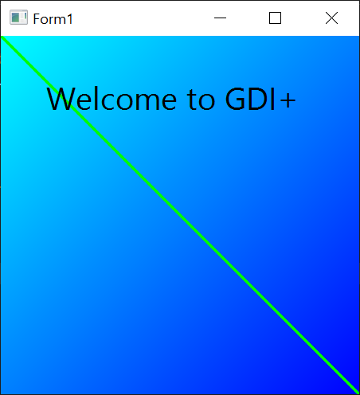

# GDI+ for twinBASIC

This is a very early preview of a higher-level GDI+ interface for twinBASIC. It is modeled after the C++ wrapper that is the official GDI+ API from Microsoft.

Since this project is under heavy development, it is set up as a simple .EXE project, not a TWINPACK like would be in order for shareable tB packages.

The benefit of .EXE during development is that demo/test code can be run instantly.

TO DO:

- [ ] \+ more glue/convenience code





The window above is produced by the following code:

``` vb
Class Form1
    Dim gdiPlus As GdiPlusUser
    
    Sub Form_Load()
        ScaleMode = vbPixels
        Set gdiPlus = GdiPlusUser()
    End Sub
            
    Sub Paint() Handles Form.Paint, Form.Resize
        Dim gr As Any = Graphics(hDC)
        Dim rect As Any = GpRectF(0, 0, ScaleWidth, ScaleHeight)
        Dim br As Any = LinearGradientBrush(rect, vbCyan, vbBlue)
        Dim ft As Any = Font("Segoe UI", 20)
        Dim fbr As Any = SolidBrush(vbBlack)
                        
        gr.FillRectangle(br, rect)
        gr.DrawLine(Pen(vbGreen, 3.0), rect)
        gr.DrawString("Welcome to GDI+", ft, GpPointF(50, 50), fbr)
    End Sub
End Class
```

Note:

- An instance of `GdiPlusUser` must exist while GDI+ objects are used. An arbitrary number of instances can exist at one time, as long as *any* exist, the GDI+ library is kept active. Since GDI+ is typically used to render forms, or is triggered by actions in the form-based UI, it is sufficient to add an instance of GdiPlusUser to any Form or other class whose code used GDI+.
- All classes can be instantiated either with `New AClass(...)` or using a convenience "constructor" function with the same signature, i.e. `AClass(...)`. This reduces verbosity in the user code.
- UDTs such as `GpPointF`, `GpRectF` etc. also have constructor functions.

